# Proyecto 6: Panel de Monitoreo en el SOC

## Implementación de Zabbix Server 7.0 en Ubuntu 24.04

---

## Descripción general de la infraestructura

He desplegado **Zabbix Server 7.0** sobre **Ubuntu 24.04 LTS** en una máquina virtual **VirtualBox**, con el objetivo de centralizar la supervisión de la infraestructura y disponer de un panel operativo para el seguimiento de disponibilidad, rendimiento y estado de servicios.

El alcance de la monitorización implementada comprende:

- Servidor Ubuntu local, nodo principal donde reside Zabbix Server.
- Máquina virtual Kali Linux, host cliente monitorizado mediante agente.

Este enfoque me ha permitido consolidar métricas, eventos y alertas en un único punto de control, facilitando la detección temprana de incidencias y el análisis de tendencias.

---

## Fase 1: Preparación del entorno base

### Actualización e instalación de componentes esenciales

He actualizado el sistema operativo e instalado las dependencias necesarias para el despliegue del stack completo de Zabbix (servidor, frontend web y base de datos). Esta fase me ha asegurado compatibilidad de paquetes, disponibilidad de librerías requeridas y estabilidad previa a la puesta en marcha.

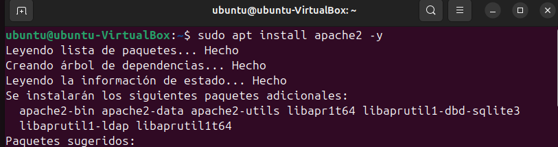

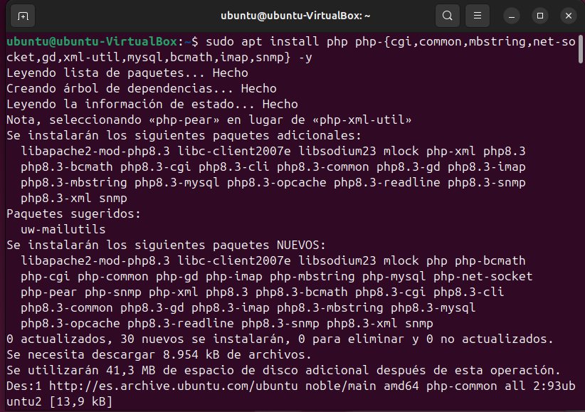

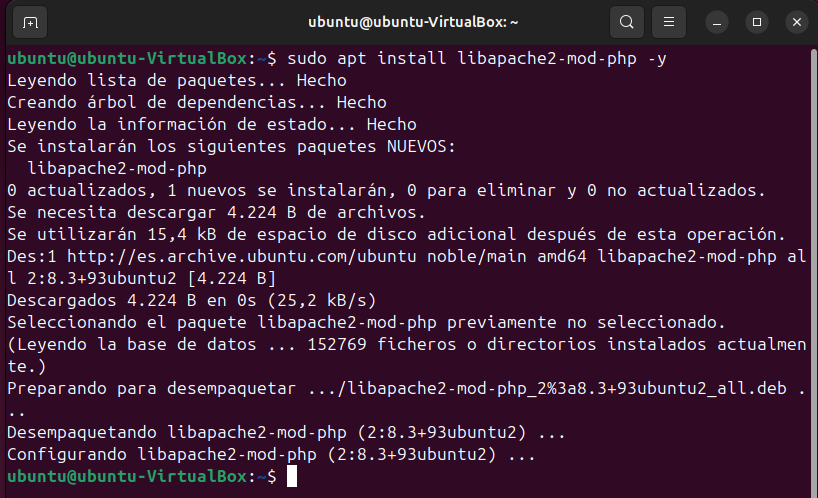

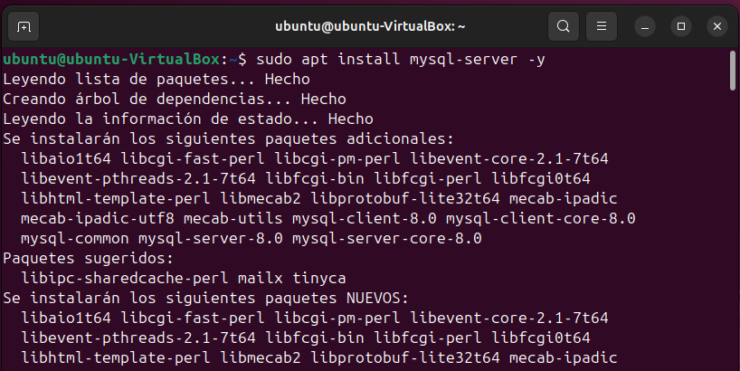

---

### 1.1 Configuración inicial de MySQL

He habilitado el servicio para arranque automático mediante el siguiente comando:

```bash
sudo systemctl enable mysql
```

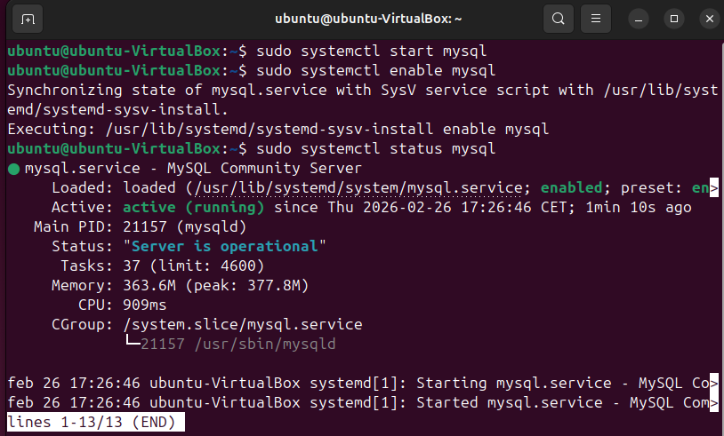

Con esta configuración, el servicio de base de datos queda habilitado para iniciarse automáticamente en cada reinicio, garantizando persistencia operativa y evitando paradas del backend de Zabbix por reinicios del sistema.

A continuación, he ajustado el siguiente parámetro para permitir la importación del esquema de Zabbix:

```sql
SET GLOBAL log_bin_trust_function_creators = 1;
```

Este parámetro facilita la creación de funciones y objetos necesarios durante la importación del esquema inicial en entornos donde MySQL aplica restricciones relacionadas con el binlog, evitando errores durante la carga inicial de la base de datos.

---

### 1.2 Instalación del repositorio oficial de Zabbix 7.0

He integrado el repositorio oficial de Zabbix para asegurar que los paquetes instalados (servidor, frontend y agentes) procedan de una fuente mantenida y con versiones alineadas entre sí. Esto reduce problemas de incompatibilidades y simplifica futuras actualizaciones.

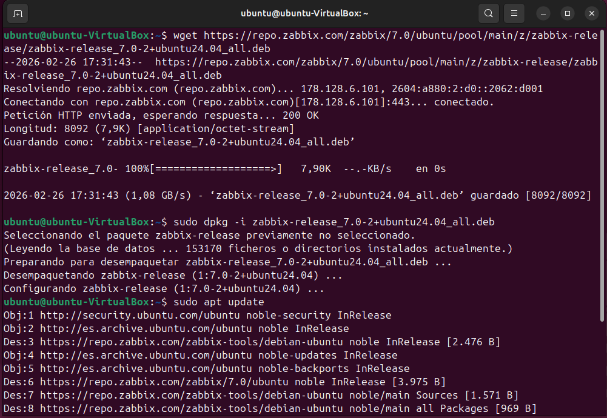


---

### 1.3 Creación y parametrización de la base de datos

He creado una base de datos dedicada y un usuario específico para Zabbix, siguiendo un criterio de separación lógica y de seguridad. Los objetivos de esta configuración son:

- Mantener los datos de Zabbix aislados: tablas, históricos, eventos y configuración.
- Aplicar el principio de mínimo privilegio al usuario de base de datos.
- Garantizar trazabilidad y un mantenimiento más sencillo del sistema.


---

### 1.4 Importación del esquema inicial de Zabbix

He importado el esquema base de Zabbix en la base de datos recién creada. Esta operación genera la estructura necesaria (tablas, relaciones e información inicial) para que el servidor pueda almacenar métricas, registrar eventos y mantener el histórico operativo.


---

### 1.5 Configuración del servidor Zabbix

He editado el archivo principal de configuración:

```bash
sudo nano /etc/zabbix/zabbix_server.conf
```

Los parámetros críticos que he configurado son los siguientes:

```text
DBHost=localhost
DBName=zabbix
DBUser=zabbix
DBPassword=[CREDENCIAL_SEGURA]
```

La finalidad de cada parámetro es la siguiente:

- **DBHost**: define el destino de la base de datos; en local mejora la latencia y simplifica el despliegue.
- **DBName**: identifica la base de datos que utilizará Zabbix para su persistencia.
- **DBUser** y **DBPassword**: credenciales del usuario dedicado, necesarias para que Zabbix lea y escriba métricas, eventos, configuración y registros de housekeeping.

Una configuración correcta en este archivo es imprescindible para que el servidor Zabbix arranque y opere de forma estable.

---

### 1.6 Activación e inicialización de servicios Zabbix

He reiniciado los servicios y configurado el inicio automático con los siguientes comandos:

```bash
sudo systemctl restart zabbix-server zabbix-agent2 apache2
sudo systemctl enable zabbix-server zabbix-agent2 apache2
```

Con esto he garantizado que:

- El servidor Zabbix esté activo para procesar checks, triggers y eventos.
- El agente local reporte métricas del propio servidor mediante auto-monitoreo.
- El servicio web (Apache) publique el frontend para administración y visualización.

He realizado la comprobación del estado de los servicios con los siguientes comandos:

```bash
sudo systemctl status zabbix-server
sudo systemctl status zabbix-agent2
```

La validación del estado ha confirmado que los servicios se encuentran en ejecución y que no existen errores de configuración ni dependencias sin resolver.


---

### 1.7 Configuración del agente local en Ubuntu

He editado el archivo del agente:

```bash
sudo nano /etc/zabbix/zabbix_agentd.conf
```

Los parámetros fundamentales configurados son:

```text
Server=127.0.0.1
ServerActive=127.0.0.1
Hostname=Ubuntu-Zabbix
```

La justificación de cada ajuste es la siguiente:

- **Server**: define qué servidor tiene permiso para consultar al agente en modo pasivo.
- **ServerActive**: especifica el servidor al que el agente enviará datos en modo activo, útil para escenarios con restricciones de red o para un mayor control del flujo de envío.
- **Hostname**: identificador lógico del host dentro de Zabbix; debe coincidir con el nombre registrado en el frontend para evitar incoherencias en el inventario.

Tras la edición, he reiniciado el agente:

```bash
sudo systemctl restart zabbix-agent2
```


---

### 1.8 Finalización mediante interfaz web

He accedido al asistente de instalación a través del siguiente endpoint:

```text
http://localhost/zabbix/setup.php
```

He completado el asistente web verificando los requisitos del entorno, la conectividad con la base de datos y los parámetros finales del frontend. Tras finalizar, he accedido al panel principal, quedando habilitada la gestión de hosts, plantillas, items, triggers y acciones automatizadas.

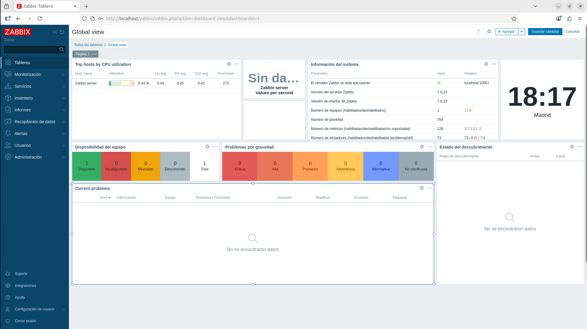

---

## Fase 2: Configuración del cliente desde Kali Linux

He instalado el agente en el cliente con el siguiente comando:

```bash
sudo apt install zabbix-agent
```

He configurado el agente del cliente para comunicarse con el servidor Zabbix y reportar métricas del sistema: CPU, memoria, disco, procesos y conectividad, entre otras. Esta fase amplía el alcance del monitoreo hacia endpoints adicionales de la red.
Para ello hemos configurado el fichero *zabbix-agentd.conf* aplicando la IP del Servidor zabbix y el hostname del cliente que posteriormente debemos de poner exactamente igual en el servidor.

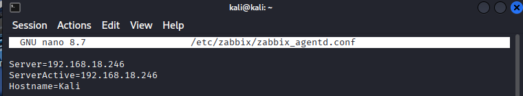

He reiniciado el servicio y comprobado su estado:

```bash
sudo systemctl restart zabbix-agent
sudo systemctl status zabbix-agent
```

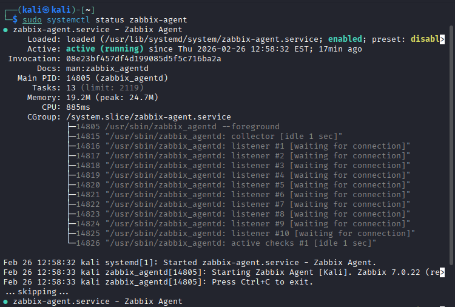

---

### Integración del cliente en el servidor

Para registrar el host cliente en el panel, he seguido el siguiente procedimiento:

1. He accedido al menú **Recopilación de datos > Equipos**.
2. He seleccionado **Crear equipo**.
3. He completado los datos del cliente: nombre, interfaz del agente, grupo asignado y plantilla correspondiente.

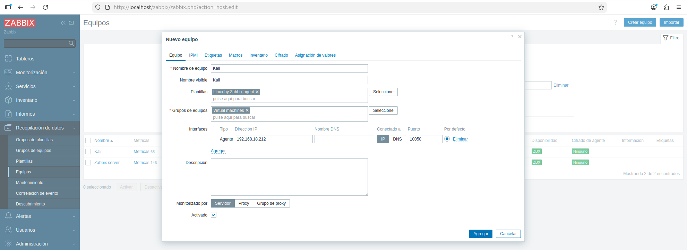

Una vez registrado, el servidor ha comenzado a asociar métricas al host y se ha habilitado la visualización centralizada en el dashboard.

---

### Verificación final

He confirmado la incorporación del cliente Kali Linux en el panel de Zabbix, verificando comunicación correcta y disponibilidad de datos en tiempo real. Con esto, la plataforma queda operativa y lista para ampliar el monitoreo a más hosts, definir umbrales de alerta personalizados y establecer acciones de notificación automatizadas.

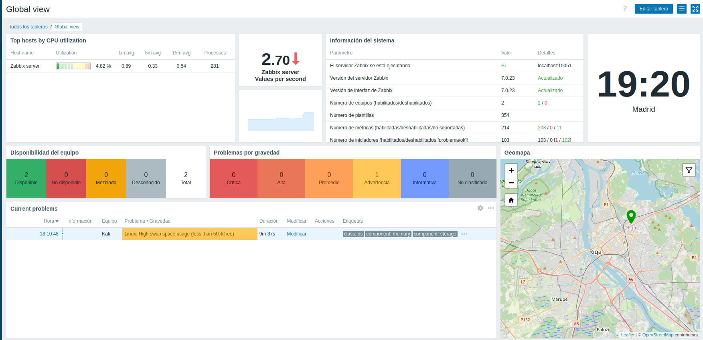

## Fase 3: Implementación de CheckMK para Monitoreo Multiplataforma

### Instalación del servidor CheckMK en Ubuntu

He procedido a instalar **CheckMK Raw Edition** siguiendo la documentación oficial de la plataforma, ejecutando los comandos proporcionados en su repositorio oficial sobre **Ubuntu 24.04 LTS**. Este proceso automatizado ha desplegado el stack completo:

- Servidor web Apache con PHP optimizado
- Base de datos MariaDB/MySQL dedicada  
- Core de monitoreo CheckMK con agente integrado
- Interfaz web multilingüe accesible por HTTPS

La instalación se ha completado sin incidencias, quedando disponible el panel de administración en `https://checkmk.com/download`.

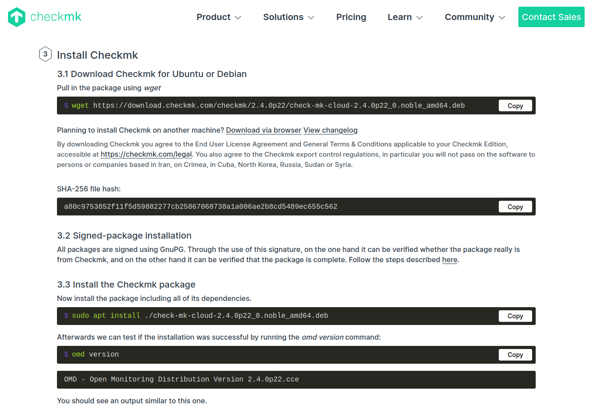

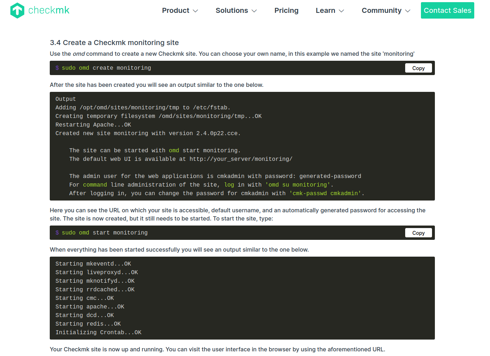

- Podemos ver que se a instalado todo correctamente siugiendo los pasos de la web oficial

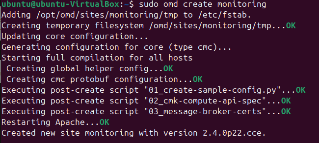

- Comprobamos finalmente en --> http://virtual-ubuntu/monitoring/

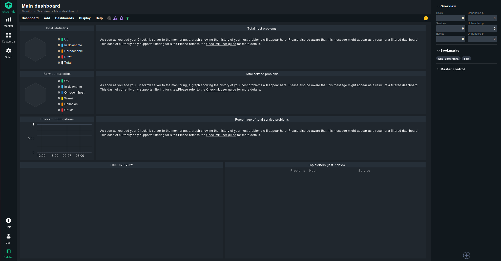
---

### 1.9 Configuración del agente CheckMK en cliente Windows 10

He descargado el instalador oficial **MSI** del agente CheckMK directamente desde el panel web del servidor recién instalado. En el equipo cliente **Windows 10**, he ejecutado el instalador con privilegios de administrador, configurando el servicio para escuchar en el puerto TCP **6556**.

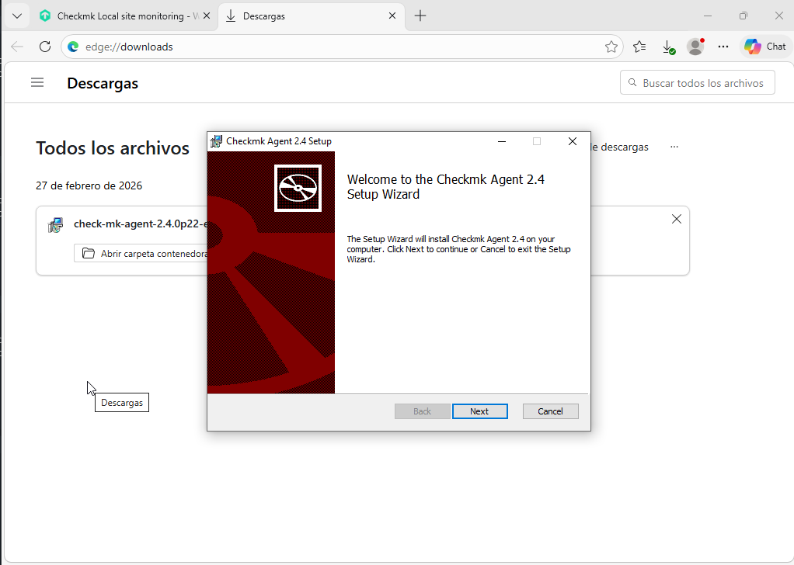

**Desafío identificado**: Windows Defender Firewall rechazaba las conexiones entrantes al puerto del agente aunque estuviera explícitamente permitido. Para resolver esta restricción, he procedido a:

1. **Deshabilitar temporalmente Windows Defender** durante la fase de pruebas
2. **Crear regla de firewall específica** para puerto 6556 TCP (Inbound/Any Profile)
3. **Reiniciar el servicio Check MK Agent**

```powershell
# Regla de firewall creada manualmente
New-NetFirewallRule -DisplayName "CheckMK Agent" -Direction Inbound -Protocol TCP -LocalPort 6556 -Action Allow
```

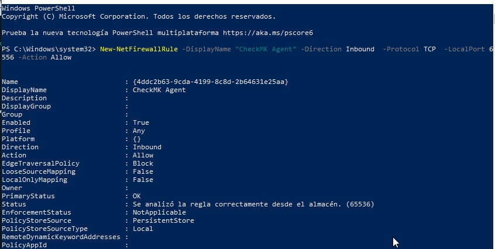

### Integración del host Windows 10 en CheckMK

En el panel web de CheckMK he seguido el procedimiento estándar de incorporación:

-   Setup → Hosts → Add host
-   Hostname: Nombre real del equipo Windows 10 (obtenido con comando hostname)
-   IP Address: 192.168.18.247
-   Agent type: CheckMK Agent (modo Pull por defecto)

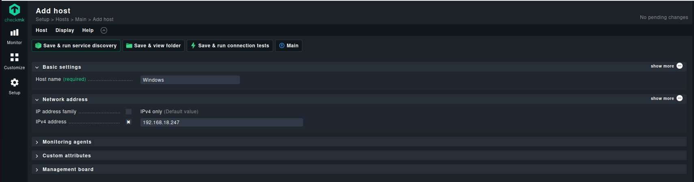

### Verificación operativa del monitoreo Windows

Confirmamos la conectividad completa desde el servidor CheckMK:

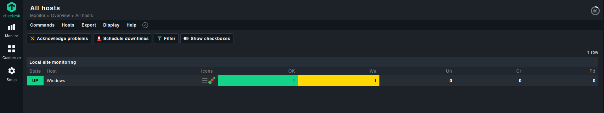

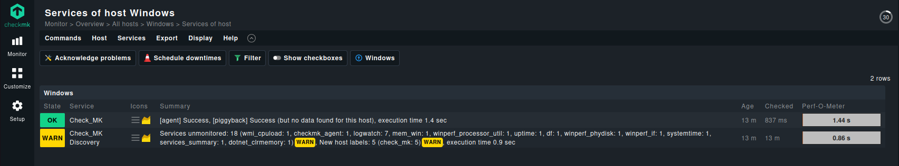

# Comparativa de Sistemas de Monitorización
## Zabbix 7.0 vs CheckMK Raw Edition

*Análisis comparativo de ambas plataformas implementadas en el SOC, evaluando 10 características técnicas clave.*

---

| Característica | Zabbix 7.0 | CheckMK Raw Edition |
|---|---|---|
| **Modelo de despliegue** | Servidor dedicado con agentes activos/pasivos. Stack manual: MySQL + Apache + PHP + Zabbix Server. | Appliance todo-en-uno. Instalación automatizada con stack integrado (Apache, MariaDB, core propio). |
| **Sistema operativo objetivo** | Linux (Ubuntu, CentOS, Debian). Agentes disponibles también para Windows, macOS y otros SO. | Linux (servidor). Agentes nativos para Windows, Linux y dispositivos de red con SNMP/IPMI. |
| **Plataformas cliente monitorizadas** | Kali Linux monitorizado vía `zabbix-agent2`. Configuración manual del archivo `agentd.conf`. | Windows 10 vía agente MSI descargado desde el panel web. Configuración guiada desde la interfaz. |
| **Protocolo de comunicación** | Puerto TCP 10050 (pasivo) y 10051 (activo). Configuración de `Server` y `ServerActive` en el agente. | Puerto TCP 6556. Modo Pull por defecto. Requiere apertura manual de regla en Windows Firewall. |
| **Interfaz de administración** | Frontend web PHP accesible en `http://localhost/zabbix`. Asistente de instalación `setup.php` integrado. | Panel web HTTPS en `http://[host]/monitoring/`. Interfaz multilingüe más moderna con flujo de trabajo guiado. |
| **Configuración de hosts** | Manual: crear equipo en *Recopilación de datos*, definir interfaz, grupo y plantilla desde el frontend. | Guiada: *Setup → Hosts → Add host*. Detección automática de servicios tras activar el host. |
| **Base de datos backend** | MySQL/MariaDB configurada manualmente. Requiere importación del esquema SQL inicial y ajuste de `log_bin_trust_function_creators`. | MariaDB integrada y gestionada automáticamente por el instalador. Sin intervención manual en el esquema. |
| **Complejidad de instalación** | **Alta**: múltiples pasos manuales (repositorio, BD, usuario, esquema, configuración de archivos `.conf`). | **Baja-Media**: un único script/instalador oficial que despliega todo el stack automáticamente. |
| **Seguridad y acceso** | Usuario de BD con mínimo privilegio, credenciales en `zabbix_server.conf`. Acceso HTTP por defecto. | Acceso por HTTPS nativo. Panel con roles y autenticación gestionados desde la propia interfaz web. |
| **Escalabilidad y extensibilidad** | Alta: soporta miles de hosts, proxies, reglas de descubrimiento automático y triggers avanzados. | Alta: soporte de múltiples sitios, *distributed monitoring* y API REST para integración con terceros. |
| **Datos de rendimiento del host** | CPU (uso, carga, cores), memoria RAM/swap, disco (espacio, I/O, latencia), red (tráfico entrante/saliente, errores, paquetes perdidos), procesos activos y uptime del sistema. | CPU (uso por core, load average), memoria RAM/swap/virtual, disco (uso, I/O, inodes), interfaces de red (tráfico, errores, estado), servicios en ejecución, temperatura y hardware (vía SNMP/IPMI). |
| **Datos de disponibilidad del host** | Estado del agente (disponible/no disponible/desconocido), latencia ICMP (ping), pérdida de paquetes, historial de disponibilidad y SLA calculado por periodos de tiempo. | Estado del host (UP/DOWN/UNREACH), latencia de respuesta del agente, historial de estados con gráficas de disponibilidad y cálculo de tiempo de inactividad acumulado. |
| **Datos de servicios y aplicaciones** | Monitorización de puertos TCP/UDP, servicios web (HTTP/HTTPS con códigos de respuesta), bases de datos, SSH, FTP, SMTP y checks personalizados vía scripts o Zabbix sender. | Checks de servicios nativos (HTTP, TCP, LDAP, DNS, SMTP), monitorización de logs, checks de certificados SSL, inventario automático de software instalado y detección de cambios en configuración. |
| **Visualización y alertas** | Dashboards personalizables con widgets (gráficas, mapas de red, top N hosts), triggers con niveles de severidad (info, warning, average, high, disaster) y acciones de notificación por email, script o webhook. | Vistas de servicio agrupadas por host/folder, gráficas de tendencia integradas (PNP4Nagios/RRDtool), sistema de notificaciones con reglas de escalado y panel de eventos con historial detallado. |

---

## Conclusión

**Zabbix 7.0** ofrece mayor control granular y flexibilidad para entornos complejos, a costa de una configuración más laboriosa. **CheckMK** destaca por su instalación simplificada, interfaz más intuitiva y despliegue acelerado de agentes en plataformas heterogéneas como Windows. Ambas soluciones son robustas para un SOC, siendo la elección dependiente del equilibrio entre control técnico y velocidad de despliegue.