## Estrategia de Copias de Seguridad

La siguiente estrategia ha sido diseñada para garantizar la integridad y
disponibilidad de los datos, optimizando el uso del almacenamiento y
minimizando el tiempo de restauración.

### Herramienta utilizada

Bacula ha sido seleccionado como software de copias de seguridad debido a su
capacidad de gestión centralizada, soporte de múltiples clientes y control
granular sobre políticas de retención.

---

## Tipos de backup utilizados

- **Full (Completa):** Todos los datos son copiados íntegramente. Es utilizada
  como base de la estrategia.
- **Differential (Diferencial):** Solo los cambios producidos desde la última
  copia Full son almacenados.
- **Incremental:** Únicamente los cambios desde el último job (Full,
  Differential o Incremental) son guardados.

---

## Planificación semanal

| Día       | Tipo         | Referencia                    |
|-----------|--------------|-------------------------------|
| Lunes     | Completa         | —                             |
| Martes    | Incremental  | Full del lunes                |
| Miércoles | Differential | Full del lunes                |
| Jueves    | Incremental  | Differential del miércoles    |
| Viernes   | Incremental  | Incremental del jueves        |
| Sábado    | Incremental  | Incremental del viernes       |
| Domingo   | Incremental  | Incremental del sábado        |

---

## Puntos fuertes

- **Reducción del espacio:** Solo una copia completa es realizada por semana.
  El resto de los días, únicamente los datos modificados son almacenados.
- **Restauración eficiente:** En el peor caso (domingo), la restauración es
  completada con un máximo de **3 elementos**: Full + Differential +
  Incrementales desde el miércoles.
- **Punto de control intermedio:** La copia diferencial del miércoles actúa
  como "cortafuegos" de la cadena incremental, reduciendo el riesgo de fallo
  en cascada.

---

## Ejemplo de restauración

> Se necesita restaurar el sistema al estado del **viernes**.

Los backups requeridos son:

- Full (lunes) → Differential (miércoles) → Incremental (jueves) → Incremental (viernes)

Sin la Differential del miércoles, serían necesarios:

- Full → Incr. martes → Incr. miércoles → Incr. jueves → Incr. viernes

La incorporación de la copia diferencial **reduce a la mitad** los backups
necesarios para la restauración y elimina puntos únicos de fallo en la cadena.

---

## Retención recomendada

| Tipo         | Retención   |
|--------------|-------------|
| Full         | 1 mes       |
| Differential | 2 semanas   |
| Incremental  | 1 semana    |

---

## FASE 2: Stack LAMP + Bacula

```bash
# PASO 7: Instalar stack LAMP (base para Baculum Web Interface)
sudo apt install apache2 mysql-server mysql-client php php-mysql -y
```

> **Explicación:** Apache y PHP son necesarios para servir la interfaz web
> de Baculum. MySQL actúa como catálogo donde Bacula almacena el historial
> de jobs y volúmenes.

```bash
# PASO 8: Instalar paquetes Bacula Community completos
sudo apt install bacula bacula-client bacula-common-mysql bacula-director-mysql bacula-server -y
```

## FASE 3: Configuración de Bacula

### Configuración del servidor Ubuntu

En el servidor se configuró el fichero `/etc/bacula/bacula-dir.conf` para definir el **Director**, los **Jobs**, los **FileSets**, los **clientes**, el **Storage Daemon** y la planificación de copias de seguridad.

Se definieron dos clientes:

- Un cliente Linux llamado `debian1`
- Un cliente Windows llamado `windows-client-fd`

Para el cliente Linux se configuró el siguiente bloque:

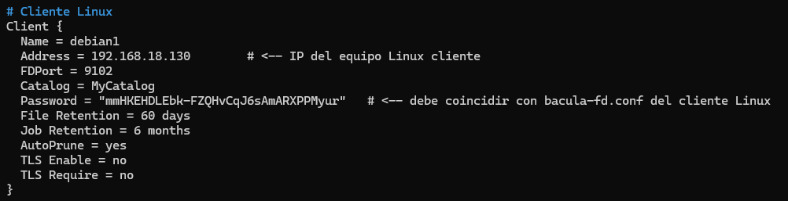

Para el cliente Windows se añadió un bloque equivalente en el Director, indicando su dirección IP, puerto de escucha y contraseña compartida con el equipo Windows:

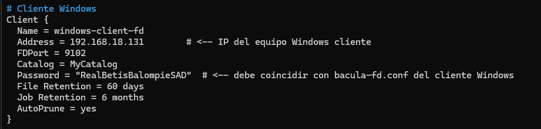

Se creó además el job `BackupClientLinux`, asociado al cliente Debian y al FileSet `Linux Set`:

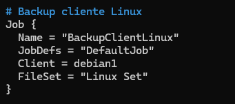

También se creó un job específico para el cliente Windows:

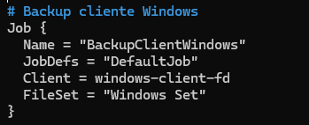

El FileSet del cliente Linux fue configurado para realizar copia de seguridad de los directorios más importantes del sistema:

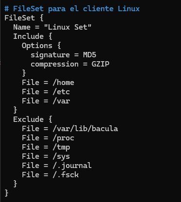

De esta forma, fueron incluidos los directorios de usuarios, configuración del sistema y datos de servicios, excluyendo rutas temporales o virtuales que no deben formar parte de una copia de seguridad.

El FileSet del cliente Windows fue configurado para incluir los directorios de usuarios y programas instalados, excluyendo rutas temporales y la papelera de reciclaje:

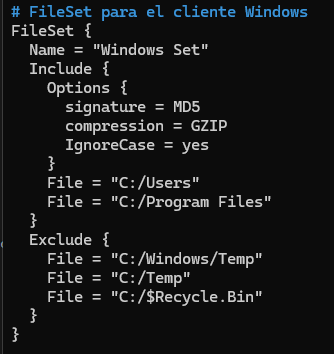

La opción `IgnoreCase = yes` fue habilitada para que Bacula trate las rutas de Windows sin distinción entre mayúsculas y minúsculas, evitando posibles problemas de coincidencia de rutas en el sistema de ficheros NTFS.

La estrategia semanal configurada en el Director fue la siguiente:

- Lunes: copia Full
- Martes: copia Incremental
- Miércoles: copia Differential
- Jueves: copia Incremental
- Viernes: copia Incremental
- Sábado: copia Incremental
- Domingo: copia Incremental

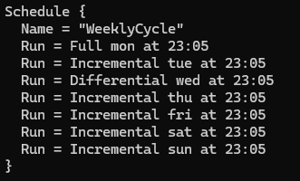

También fue necesario configurar correctamente el recurso de almacenamiento para que los clientes pudieran enviar los datos al servidor. Finalmente, el Storage quedó apuntando a la IP real del servidor y al dispositivo de almacenamiento correcto, evitando el uso de `localhost` y de dispositivos de ejemplo no válidos.

---

### Configuración del File Daemon del servidor

En el servidor también se revisó el archivo `/etc/bacula/bacula-fd.conf`, correspondiente al File Daemon local. Este servicio permite que el propio servidor pueda actuar como cliente de Bacula en operaciones locales, además de participar en tareas de restauración y mantenimiento.

La configuración principal utilizada fue la siguiente:

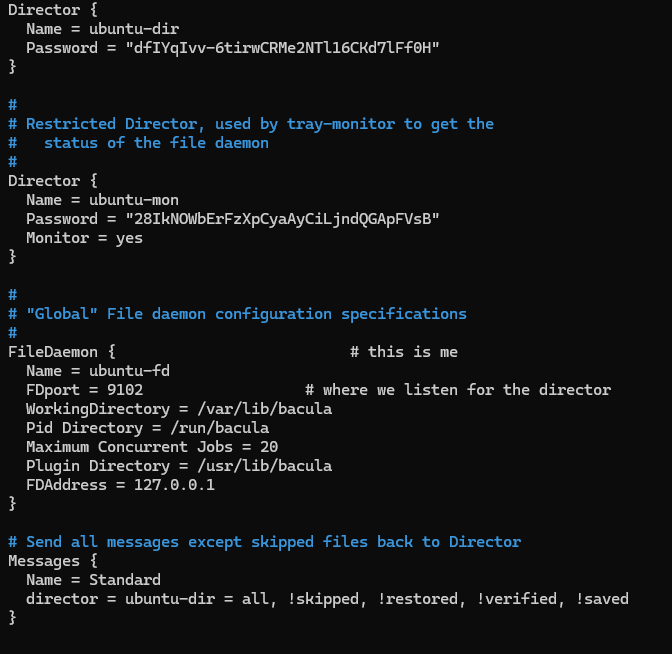

En esta configuración se autorizó al Director `ubuntu-dir` a comunicarse con el File Daemon del servidor mediante una contraseña compartida. El daemon quedó escuchando en el puerto `9102`, con dirección `127.0.0.1`, lo que indica que solo acepta conexiones locales en el propio servidor.

---

### Configuración del Storage Daemon del servidor

También se configuró el archivo `/etc/bacula/bacula-sd.conf`, encargado de definir el Storage Daemon, es decir, el servicio responsable de almacenar físicamente las copias de seguridad.

La configuración principal fue la siguiente:

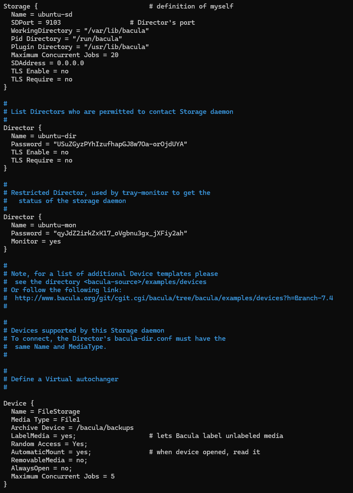

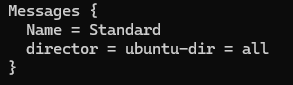

En esta práctica se simplificó la configuración por defecto del Storage Daemon, eliminando la necesidad de usar autochangers virtuales y dispositivos de ejemplo que apuntaban a rutas inexistentes. Se dejó únicamente un dispositivo de almacenamiento válido, llamado `FileStorage`, con tipo de medio `File1` y ruta física `/bacula/backups`.

De esta forma, tanto el cliente Debian como el cliente Windows utilizaron el mismo almacenamiento de disco para guardar sus copias de seguridad, sin necesidad de definir un `Device` distinto para cada cliente.

# Configuración del cliente Debian

En el cliente Debian se instaló el paquete necesario mediante:

```bash
apt install bacula-client
```

Posteriormente se editó el archivo `/etc/bacula/bacula-fd.conf` para permitir la conexión del Director del servidor.

La configuración aplicada fue la siguiente:

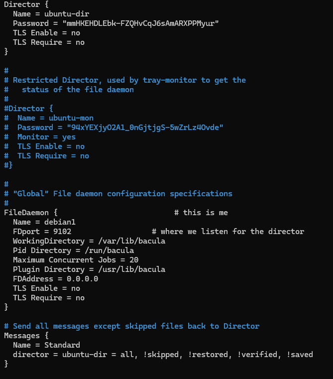

Con esta configuración:

- El nombre del cliente quedó igual que en el servidor (`debian1`)
- La contraseña del bloque `Director` coincidió exactamente con la definida en el servidor para ese cliente
- El daemon quedó escuchando en el puerto `9102`
- Se permitió la escucha en todas las interfaces con `FDAddress = 0.0.0.0`

---

## Comprobación de conectividad

Para verificar la conectividad entre servidor y cliente, se realizaron varias pruebas.

Desde el servidor se comprobó que el cliente Debian aceptaba conexiones en el puerto `9102`:

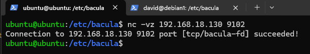

En el cliente Debian se verificó que el File Daemon estaba escuchando correctamente:

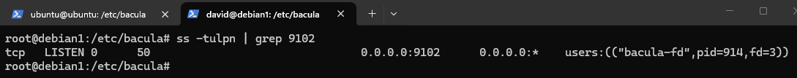

También se comprobó desde `bconsole` que el servidor podía contactar con el cliente:

```text
* status client=debian1
```

La respuesta del daemon confirmó que la comunicación era correcta.

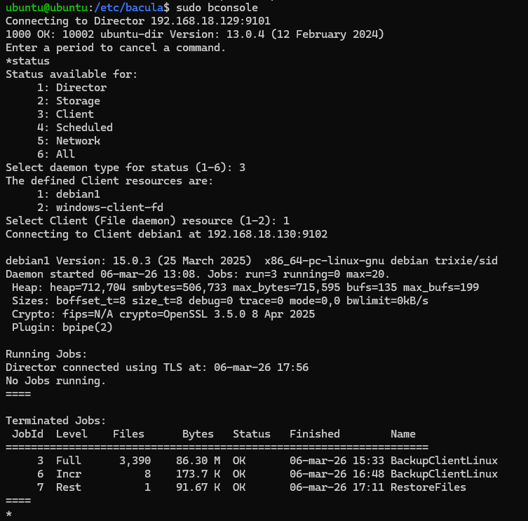

---

## Ejecución y verificación de la copia de seguridad

Una vez corregida la configuración, se lanzó manualmente el job desde `bconsole`:

```text
* run job=BackupClientLinux yes
```

Al no existir una copia Full previa en el catálogo, Bacula promovió la ejecución a una copia completa.

Posteriormente se comprobó el resultado con:

```text
* list jobs
```

Resultado final:

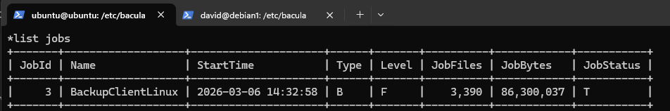

La letra `T` en `JobStatus` indica que el trabajo terminó correctamente.

Con ello quedó verificado que:

- El servidor Bacula se comunica correctamente con el cliente Debian
- El cliente Debian se comunica correctamente con el Storage Daemon
- La copia Full del cliente Linux se ejecutó de forma satisfactoria
- Fueron respaldados 3.390 archivos con un total de 86.300.037 bytes

## Instalación del cliente Bacula en Windows

Para incorporar un equipo Windows al sistema de copias de seguridad, se instaló el **cliente de Bacula (File Daemon)** en la máquina Windows. Este componente permite que el servidor Bacula se conecte al equipo cliente y realice la copia de los archivos configurados.

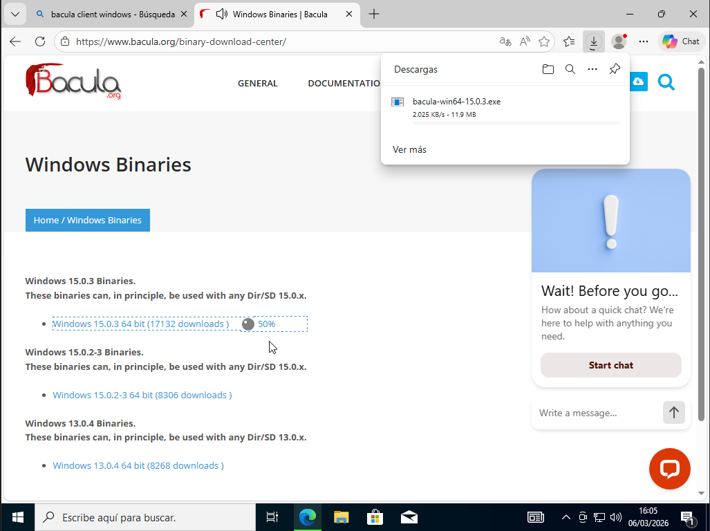

### Instalación del software

En primer lugar, se ejecutó el instalador de Bacula para Windows. Durante el asistente de instalación se seleccionó la opción **Custom**, y dentro de ella se marcó únicamente el componente **Client**, ya que el objetivo era instalar solo el agente cliente en el equipo Windows.

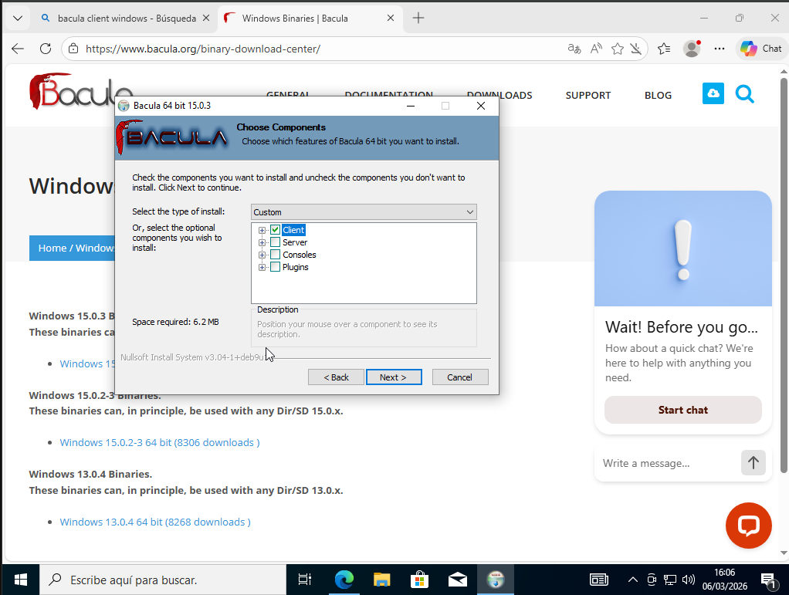

Durante la instalación se configuraron los siguientes parámetros principales:

- **Name**: nombre identificativo del cliente Windows.
- **Port**: puerto de escucha del File Daemon, manteniendo el valor por defecto `9102`.
- **Max Jobs**: número máximo de trabajos concurrentes permitidos.
- **Password**: contraseña compartida con el servidor Bacula.
- **Install as service**: activado, para instalar el cliente como servicio de Windows.
- **Start after install**: activado, para iniciar el servicio automáticamente tras la instalación.

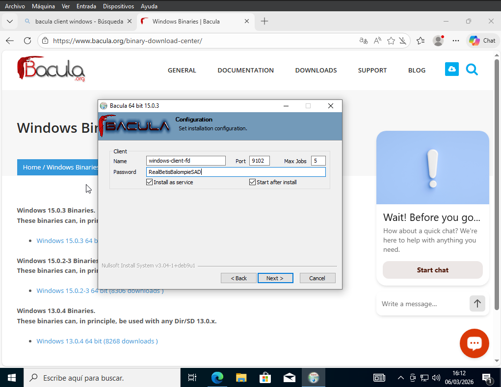

### Configuración adicional del instalador

En la última pantalla del instalador se solicitó la información del **Director**. En este apartado se introdujo el nombre del Director configurado en el servidor:

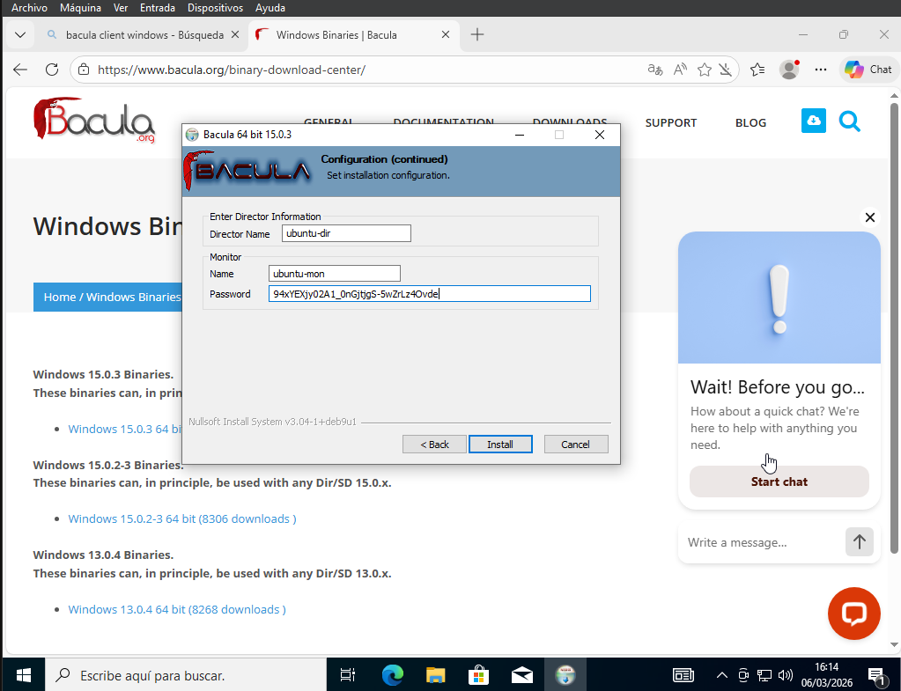

Además, el asistente generó automáticamente un nombre y una contraseña para el Monitor de Windows. Estos valores se pueden dejar por defecto, ya que el monitor no era imprescindible para la realización de la copia de seguridad, aunque yo le he modificado y puesto correctamente, debe de ser la misma contraseña que en `Console` dentro de `Bacula-dir.conf`.

---

### Consideraciones importantes

Para que la instalación funcionase correctamente, fue necesario tener en cuenta los siguientes aspectos:

- El nombre del cliente en Windows debía coincidir exactamente con el configurado en el servidor.
- La contraseña introducida en el instalador debía ser la misma que la definida en `bacula-dir.conf`.
- El puerto `9102/TCP` debía estar accesible en el firewall de Windows.
- El servicio `bacula-fd` debía quedar iniciado tras la instalación.

---

### Verificación de funcionamiento

Una vez finalizada la instalación y realizada la configuración del servidor, se ejecutó una copia de seguridad manual desde `bconsole` con el siguiente comando:

```text
run job=BackupClientWindows yes
```

Durante la comprobación se observó que el servidor:

- Conectó correctamente con el Storage Daemon.
- Utilizó el dispositivo de almacenamiento configurado.
- Estableció conexión con el cliente Windows en el puerto `9102`.
- Preparó el volumen de copia para la escritura de datos.

Esto confirmó que la instalación del cliente Windows y su integración con el servidor Bacula se realizaron correctamente.

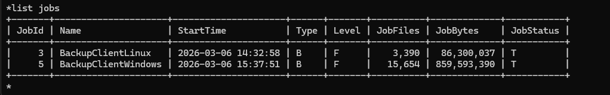

Realizamos una segunda copia de seguridad al cliente Debian1 para corroborar que ambos están configurados correctamente:

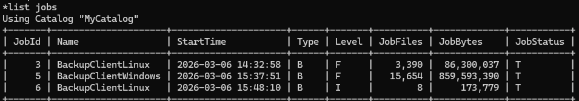

La segunda copia realizada sobre el cliente Debian mostró un número muy inferior de archivos respaldados porque Bacula la ejecutó como copia **Incremental**. A diferencia de la copia **Full**, que guarda todos los archivos del `FileSet`, la copia incremental solo almacena los ficheros modificados desde la última copia correcta, por lo que en este caso únicamente se copiaron 8 archivos.


---

### Incidencia encontrada

Durante las primeras pruebas apareció un error relacionado con el dispositivo de almacenamiento:

```text
Storage daemon "File1" didn't accept Device "FileChgr1" because: Device "FileChgr1" not in SD Device resources or no matching Media Type
```

El problema no estaba en la instalación del cliente Windows, sino en una incoherencia entre la configuración del Director y la del Storage Daemon del servidor. En `bacula-dir.conf` se estaba utilizando el dispositivo `FileChgr1`, mientras que en `bacula-sd.conf` el dispositivo realmente definido era `FileStorage`.

### Solución aplicada

La solución consistió en corregir el recurso `Storage` del servidor para que utilizase el dispositivo real configurado en el Storage Daemon:

```conf
Storage {
  Name = File1
  Address = 192.168.18.129
  SDPort = 9103
  Password = "**"
  Device = FileStorage
  Media Type = File1
  Maximum Concurrent Jobs = 10
  TLS Enable = no
  TLS Require = no
}
```

Una vez realizado este cambio y reiniciados los servicios de Bacula, el backup del cliente Windows pudo iniciarse correctamente.

---

### Resultado

Con esta configuración, el cliente Bacula en Windows quedó correctamente instalado, registrado en el servidor y preparado para ejecutar copias de seguridad remotas desde el Director.

## Restauración de un archivo en el cliente `debian1`

Para verificar el funcionamiento de la restauración en Bacula, se realizó una prueba práctica consistente en eliminar previamente un archivo del cliente Debian y recuperarlo posteriormente desde las copias de seguridad almacenadas en el servidor.

### 1. Eliminación previa del archivo

En el cliente `debian1` se eliminó manualmente el archivo:

```text
/var/backups/dpkg.status.1.gz
```

El objetivo de esta prueba fue comprobar que Bacula era capaz de localizar el fichero en el catálogo y restaurarlo correctamente a partir de las copias realizadas anteriormente.

### 2. Acceso a bconsole

La restauración se inició desde el servidor Bacula accediendo a la consola de administración:

```bash
sudo bconsole
```

Una vez dentro, se ejecutó el comando:

```text
restore
```

Este comando permitió lanzar el asistente interactivo de restauración de Bacula.

### 3. Selección del origen de la restauración

Dentro del menú de restauración se eligió la opción:

```text
5: Select the most recent backup for a client
```

Posteriormente se seleccionó el cliente:

```text
debian1
```

Bacula identificó automáticamente los JobId válidos más recientes asociados a este cliente y al FileSet `Linux Set`, seleccionando los siguientes trabajos:

- JobId 3 → copia Full
- JobId 6 → copia Incremental

De esta manera, Bacula construyó el árbol de directorios utilizando tanto la copia completa como la incremental, permitiendo recuperar el estado más reciente del sistema.

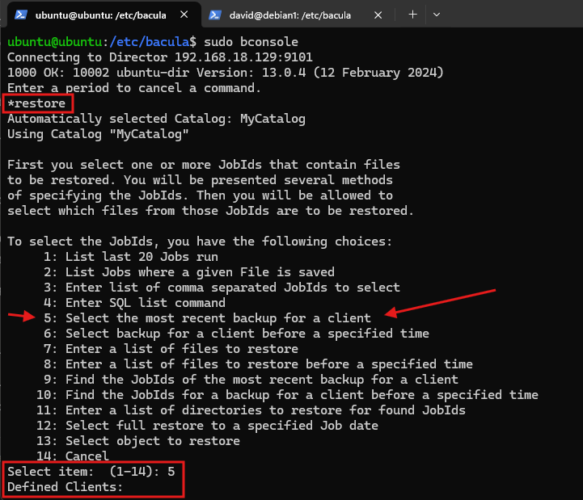


### 4. Selección del archivo a restaurar

Una vez cargado el árbol de archivos, se accedió al directorio donde se encontraba el fichero eliminado:

```text
cd /var/backups
```

A continuación se listó el contenido del directorio para verificar que el archivo existía en el catálogo:

```text
ls
```

Después se marcó el archivo concreto para restaurar:

```text
mark dpkg.status.1.gz
```

Una vez seleccionado, se finalizó la fase de selección con:

```text
done
```

Bacula indicó entonces que se había seleccionado 1 archivo para ser restaurado.

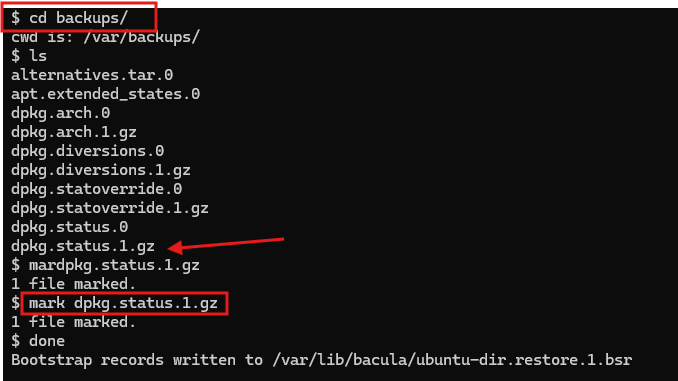

### 5. Confirmación del job de restauración

Antes de ejecutar la restauración, Bacula mostró el resumen del job:

- **JobName**: RestoreFiles
- **Where**: /tmp/bacula-restores
- **Backup Client**: debian1
- **Restore Client**: debian1
- **Storage**: File1
- **Replace**: Always

Finalmente, se confirmó la ejecución con:

```text
yes
```

Tras ello, Bacula creó el trabajo de restauración con:

```text
JobId = 7
```

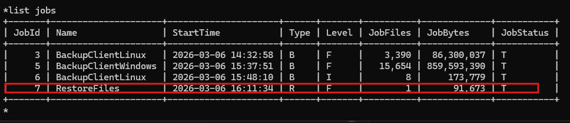

### 6. Ejecución de la restauración

Durante la ejecución del job, Bacula informó de los siguientes pasos:

- Restauración de archivos a partir de los JobId 3 y 6
- Conexión correcta con el Storage Daemon
- Uso del dispositivo `FileStorage` para lectura
- Conexión correcta con el cliente `debian1`
- Lectura del volumen `Vol-0001`

Todo ello confirmó que Bacula pudo acceder correctamente a la copia almacenada y reenviar el archivo al cliente Debian.

### 7. Resultado final

El resumen final del trabajo de restauración fue el siguiente:

- **Files Expected**: 1
- **Files Restored**: 1
- **Bytes Restored**: 91,673
- **FD Errors**: 0
- **SD termination status**: OK
- **Termination**: Restore OK

Esto confirmó que la restauración se completó correctamente y sin errores.

### 8. Ubicación del archivo restaurado

El archivo no fue restaurado directamente en su ruta original, sino en el directorio alternativo definido en el job de restauración:

```text
/tmp/bacula-restores
```

Por tanto, la ruta esperada del archivo restaurado fue:

```text
/tmp/bacula-restores/var/backups/dpkg.status.1.gz
```

Este comportamiento es recomendable, ya que permite verificar primero el contenido restaurado antes de copiarlo manualmente a su ubicación original.

### 9. Comprobación posterior

Una vez finalizado el restore, se pudo comprobar la existencia del archivo restaurado con:


Si se deseaba devolver el fichero a su ubicación original, podía hacerse manualmente con:

```bash
sudo cp /tmp/bacula-restores/etc/backups/dpkg.status.1.gz /etc/backups/
```

### 10. Ficheros Bacula Server:

Se adjuntaron los 3 ficheros `bacula-dir - bacula-sd y bacula-fd` al repositorio para mayor visibilidad.

## Instalación de Baculum API y Baculum Web

Con el objetivo de disponer de una interfaz web para la administración de Bacula, se procedió a la instalación de **Baculum API** y **Baculum Web** sobre el servidor Ubuntu. Baculum permite gestionar trabajos de copia de seguridad, restauraciones, acceso al catálogo y, opcionalmente, la configuración de los componentes de Bacula desde entorno web.

---

### Repositorio de Baculum

Como los paquetes de Baculum no se encontraban en los repositorios estándar del sistema, fue necesario añadir previamente el repositorio oficial de Baculum y su clave pública.

Para ello se ejecutó el siguiente comando para importar la clave del repositorio:

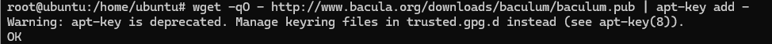

A continuación, se añadió el repositorio correspondiente a Bacula Director 11 o superior:

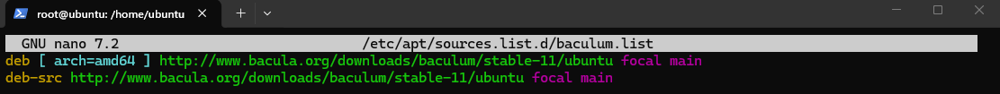

Estas líneas se incorporaron al sistema de repositorios APT en el fichero:

```bash
/etc/apt/sources.list.d/baculum.list
```

Una vez añadido el repositorio, se actualizó la información de paquetes disponible:

```bash
sudo apt update
```

---

### Instalación de Baculum API

El primer componente instalado fue Baculum API, que actúa como backend de comunicación entre Baculum Web y Bacula.

La instalación se realizó con:

```bash
sudo apt-get install baculum-common baculum-api baculum-api-apache2
```

Tras la instalación, fue necesario habilitar el módulo rewrite de Apache:

```bash
sudo a2enmod rewrite
```

También se habilitó el sitio virtual correspondiente a la API de Baculum:

```bash
sudo a2ensite baculum-api
```

Finalmente, se reinició Apache para aplicar la nueva configuración:

```bash
sudo systemctl restart apache2
```

Una vez completado este proceso, la API de Baculum quedó accesible en el puerto:

```text
http://IP_DEL_SERVIDOR:9096
```

---

### Instalación de Baculum Web

Posteriormente se instaló la interfaz gráfica Baculum Web, que es el frontend desde el cual se administran los trabajos de Bacula.

La instalación se realizó mediante:

```bash
sudo apt-get install baculum-common baculum-web baculum-web-apache2
```

Igual que en el caso anterior, fue necesario habilitar el módulo rewrite de Apache:

```bash
sudo a2enmod rewrite
```

También se habilitó el sitio virtual de Baculum Web:

```bash
sudo a2ensite baculum-web
```

Por último, se reinició Apache:

```bash
sudo systemctl restart apache2
```

Una vez finalizada la instalación, la interfaz web quedó accesible en:

```text
http://IP_DEL_SERVIDOR:9095
```

---

### Configuración inicial de Baculum API

Antes de utilizar Baculum Web fue necesario configurar primero la API, ya que la interfaz web depende de ella para conectarse con Bacula.

La configuración se realizó accediendo mediante navegador a:

`http://192.168.18.129:9096/`

En el asistente de configuración inicial se definieron los siguientes elementos:

- Método de autenticación de la API.
- Acceso al catálogo de Bacula.

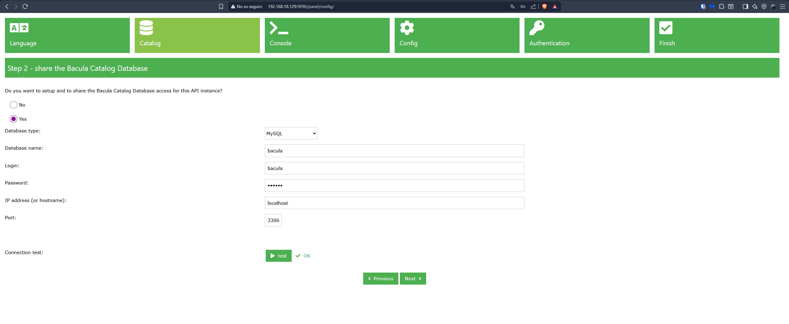

- Acceso a `bconsole`.

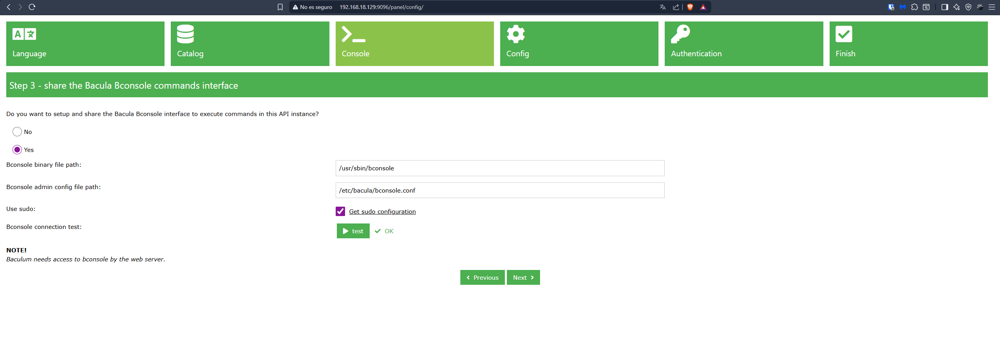

- Acceso opcional al módulo de configuración de Bacula.

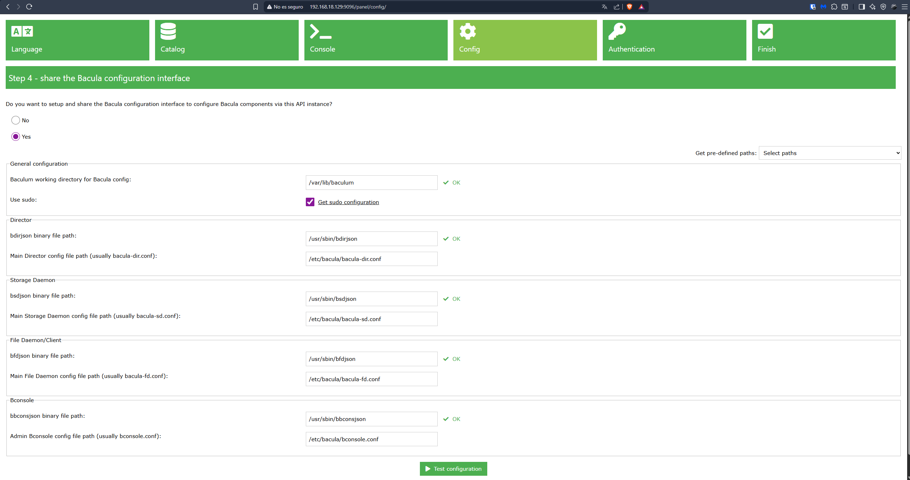

Durante esta fase se seleccionó la autenticación HTTP Basic, que permite a Baculum Web comunicarse con la API mediante usuario y contraseña.

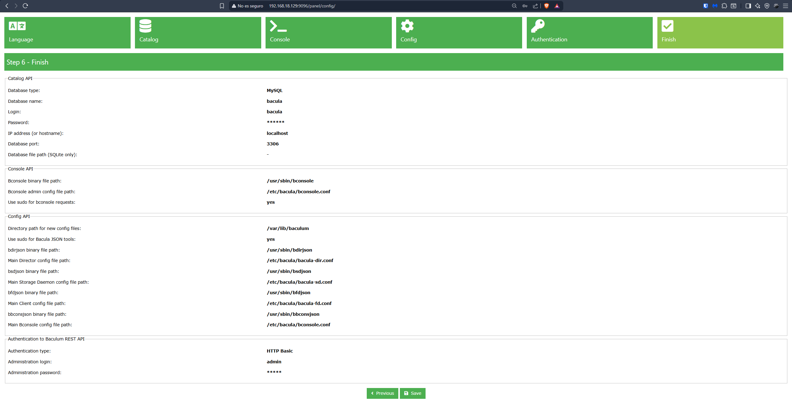

También se configuró el acceso a la base de datos del catálogo existente de Bacula, utilizando los mismos parámetros ya definidos en el `bacula-dir.conf` del servidor, de forma que Baculum reutilizase la base de datos ya existente en lugar de crear una nueva.

---

### Configuración del acceso a bconsole

Para que Baculum API pudiera ejecutar comandos de Bacula a través de `bconsole`, fue necesario permitir al usuario del servidor web (`www-data` en Ubuntu con Apache) ejecutar dicho binario mediante `sudo` sin contraseña.

Para ello se creó un fichero de configuración en:

```bash
/etc/sudoers.d/baculum-api
```

El contenido añadido fue el siguiente:

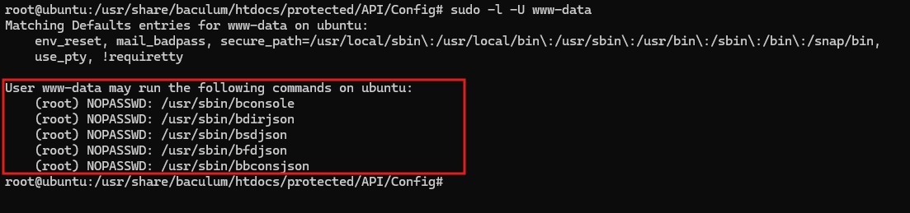

Este fichero se creó utilizando `visudo` para validar su sintaxis de forma segura:

```bash
sudo visudo -f /etc/sudoers.d/baculum-api
```

Posteriormente se corrigieron sus permisos para cumplir con los requisitos de `sudoers`:

```bash
sudo chown root:root /etc/sudoers.d/baculum-api
sudo chmod 0440 /etc/sudoers.d/baculum-api
sudo visudo -c
```

Con ello quedó autorizado el acceso a `bconsole` desde Baculum API.

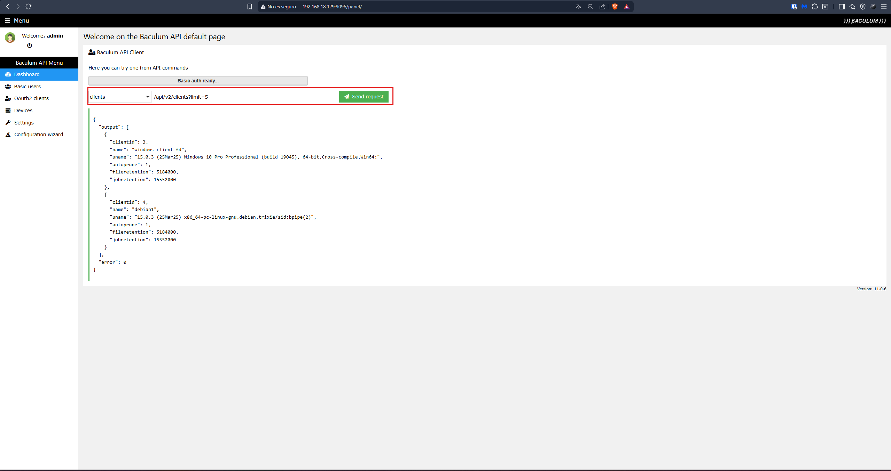

---

### Permisos para gestión de configuración

Al activar desde Baculum la opción de administración de la configuración de Bacula, apareció un error de permisos al intentar escribir en los archivos de `/etc/bacula/`, ya que el usuario `www-data` no tenía permisos de escritura sobre dichos ficheros.

El error observado fue similar a:

```text
Error 1000 - Internal error.
[Warning] file_put_contents(/etc/bacula/bacula-dir.conf): Failed to open stream: Permission denied
```

Para resolverlo, se añadieron permisos adecuados al usuario del servidor web mediante el grupo `bacula`, permitiendo que Baculum pudiera modificar los archivos de configuración.

Se aplicaron los siguientes comandos:

```bash
sudo usermod -aG bacula www-data
sudo chown bacula:bacula /etc/bacula/bacula-dir.conf /etc/bacula/bacula-sd.conf /etc/bacula/bacula-fd.conf /etc/bacula/bconsole.conf
sudo chmod 660 /etc/bacula/bacula-dir.conf /etc/bacula/bacula-sd.conf /etc/bacula/bacula-fd.conf /etc/bacula/bconsole.conf
sudo chown root:bacula /etc/bacula
sudo chmod 775 /etc/bacula
sudo systemctl restart apache2
```

Con estos cambios, Baculum pudo acceder correctamente a los ficheros de configuración del entorno Bacula.

---

### Configuración de Baculum Web

Una vez configurada correctamente la API, se accedió a Baculum Web mediante:

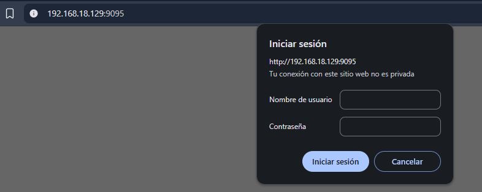

En el primer acceso se utilizó la autenticación de la API configurada previamente y, desde la sección de conexión con la API, se registró el host local con los siguientes parámetros:

- **Protocol**: HTTP
- **IP Address / Hostname**: IP_DEL_SERVIDOR
- **Port**: 9096
- **Authentication**: HTTP Basic
- **API Login**: usuario configurado en la API
- **API Password**: contraseña configurada en la API

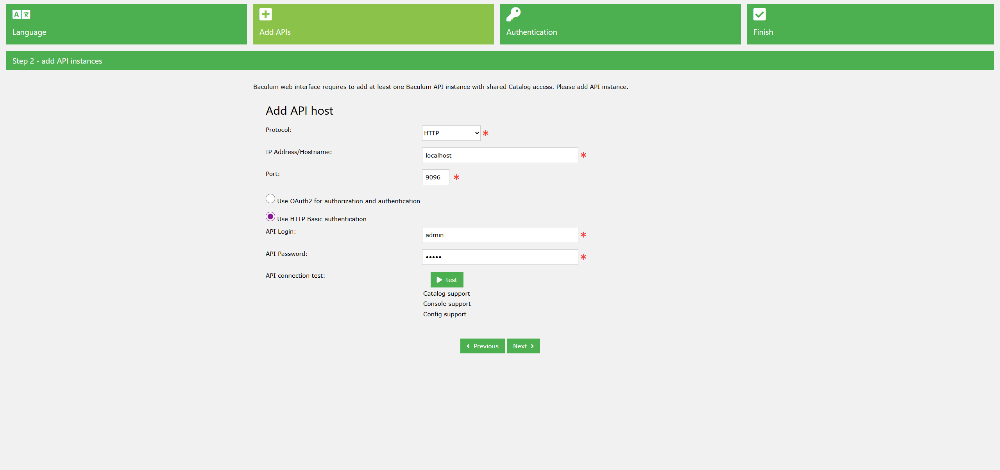

Una vez validada la conectividad, Baculum Web quedó enlazado con la API y pudo comenzar a mostrar la información del entorno Bacula.

---

### Resultado final

Tras completar la instalación y configuración de ambos componentes, se obtuvo una interfaz web plenamente funcional para la administración de Bacula.

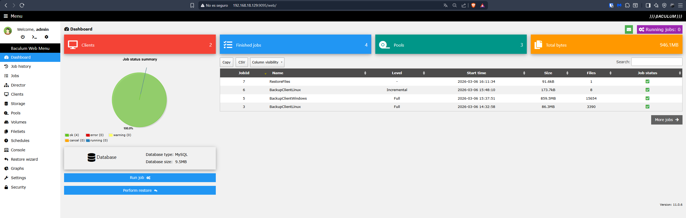

Podemos ver la información de bacula totalmente en la Web.

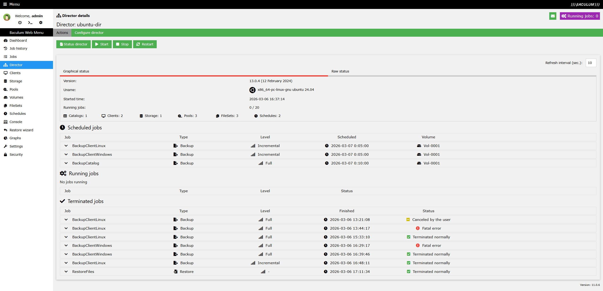

Vamos a realizar un Backup del cliente Debian en la WEB, para ello hemos configurado lo siguiente:

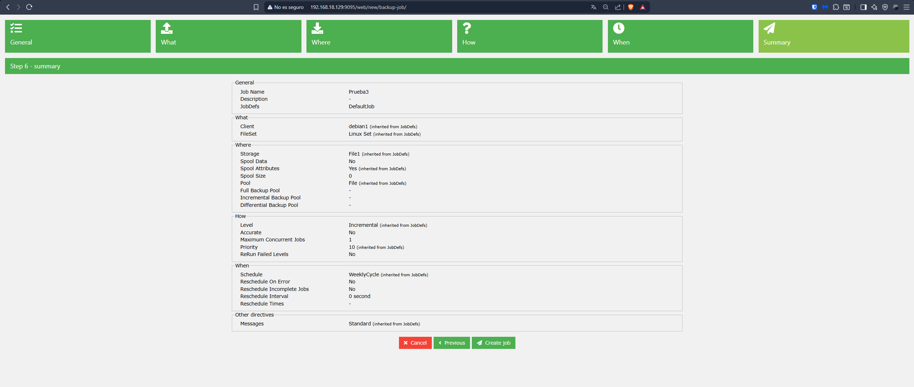

Conseguimos ver que se a realizado correctamente el Backup incremental:

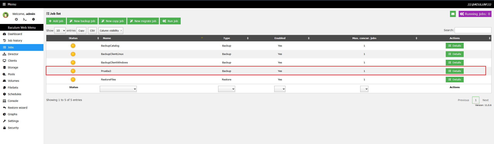

De este modo, el sistema Bacula quedó complementado con una interfaz web centralizada, facilitando la administración de las copias de seguridad sin depender exclusivamente de `bconsole`.