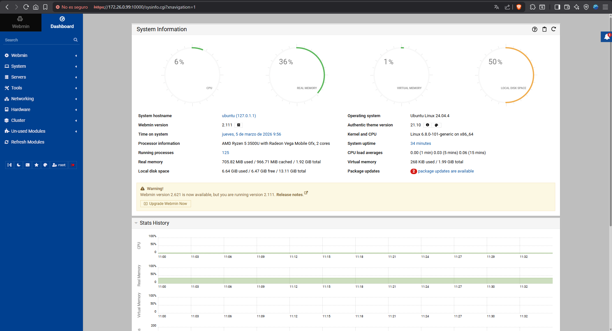

## Estrategia de Copias de Seguridad

La siguiente estrategia ha sido diseñada para garantizar la integridad y
disponibilidad de los datos, optimizando el uso del almacenamiento y
minimizando el tiempo de restauración.

### Herramienta utilizada

Bacula ha sido seleccionado como software de copias de seguridad debido a su
capacidad de gestión centralizada, soporte de múltiples clientes y control
granular sobre políticas de retención.

---

## Tipos de backup utilizados

- **Full (Completa):** Todos los datos son copiados íntegramente. Es utilizada
  como base de la estrategia.
- **Differential (Diferencial):** Solo los cambios producidos desde la última
  copia Full son almacenados.
- **Incremental:** Únicamente los cambios desde el último job (Full,
  Differential o Incremental) son guardados.

---

## Planificación semanal

| Día       | Tipo         | Referencia                    |
|-----------|--------------|-------------------------------|
| Lunes     | Completa         | —                             |
| Martes    | Incremental  | Full del lunes                |
| Miércoles | Differential | Full del lunes                |
| Jueves    | Incremental  | Differential del miércoles    |
| Viernes   | Incremental  | Incremental del jueves        |
| Sábado    | Incremental  | Incremental del viernes       |
| Domingo   | Incremental  | Incremental del sábado        |

---

## Puntos fuertes

- **Reducción del espacio:** Solo una copia completa es realizada por semana.
  El resto de los días, únicamente los datos modificados son almacenados.
- **Restauración eficiente:** En el peor caso (domingo), la restauración es
  completada con un máximo de **3 elementos**: Full + Differential +
  Incrementales desde el miércoles.
- **Punto de control intermedio:** La copia diferencial del miércoles actúa
  como "cortafuegos" de la cadena incremental, reduciendo el riesgo de fallo
  en cascada.

---

## Ejemplo de restauración

> Se necesita restaurar el sistema al estado del **viernes**.

Los backups requeridos son:

- Full (lunes) → Differential (miércoles) → Incremental (jueves) → Incremental (viernes)

Sin la Differential del miércoles, serían necesarios:

- Full → Incr. martes → Incr. miércoles → Incr. jueves → Incr. viernes

La incorporación de la copia diferencial **reduce a la mitad** los backups
necesarios para la restauración y elimina puntos únicos de fallo en la cadena.

---

## Retención recomendada

| Tipo         | Retención   |
|--------------|-------------|
| Full         | 1 mes       |
| Differential | 2 semanas   |
| Incremental  | 1 semana    |


# Documentación: Instalación Webmin + Bacula

---

## FASE 1: Instalación Webmin 2.111

```bash
# PASO 2: Descargar paquete oficial desde GitHub Releases
# Versión estable 2.111 compatible con Ubuntu 24.04 (Noble)
wget https://github.com/webmin/webmin/releases/download/2.111/webmin_2.111_all.deb
```

> **Explicación:** Descarga directa del repositorio oficial. Se evitan
> repositorios obsoletos como `sarge`, incompatibles con Ubuntu 24.04.

```bash
# PASO 3: Instalar paquete principal
# Puede fallar por dependencias no resueltas en este punto
sudo dpkg -i webmin_2.111_all.deb
```

> **Explicación:** `dpkg` instala el .deb directamente pero no resuelve
> dependencias automáticamente, a diferencia de `apt`.

```bash
# PASO 4: Resolver dependencias automáticamente
sudo apt update
sudo apt install -f
```

> **Explicación:** `apt install -f` (fix-broken) detecta e instala todas las
> dependencias faltantes del paso anterior:
> `libauthen-pam-perl`, `libnet-ssleay-perl`, `libio-pty-perl`.

```bash
# PASO 5: Instalar dependencias adicionales específicas de Webmin
sudo apt install libauthen-pam-perl libio-pty-perl libnet-ssleay-perl apt-show-versions
```

> **Explicación:** `apt-show-versions` es necesario para que Webmin pueda
> mostrar versiones de paquetes instalados en el sistema.

```bash
# PASO 6: Configurar contraseña del usuario root
sudo passwd root
```

> **Explicación:** Webmin requiere autenticación como `root`. Ubuntu deshabilita
> el usuario root por defecto, por lo que se debe establecer su contraseña
> manualmente antes de acceder a la interfaz web.

## Acceso a Webmin

```
URL:        https://IP_DEL_SERVIDOR:10000
Usuario:    root
Contraseña: La configurada en "sudo passwd root"
```

> **Nota:** Al acceder por primera vez, el navegador mostrará una advertencia
> de certificado SSL autofirmado. Acepta la excepción de seguridad para continuar.



---

## FASE 2: Stack LAMP + Bacula

```bash
# PASO 7: Instalar stack LAMP (base para Baculum Web Interface)
sudo apt install apache2 mysql-server mysql-client php php-mysql -y
```

> **Explicación:** Apache y PHP son necesarios para servir la interfaz web
> de Baculum. MySQL actúa como catálogo donde Bacula almacena el historial
> de jobs y volúmenes.

```bash
# PASO 8: Instalar paquetes Bacula Community completos
sudo apt install bacula bacula-client bacula-common-mysql bacula-director-mysql bacula-server -y
```

## FASE 3: Configuración Archivos Bacula


En el cliente Debian realizamos la instalacion con el comando apt install bacula-client y configuramos el archivo nano /etc/bacula/bacula-fd.conf, cambiamos los nombres a los del servidor y nos aseguramos que las contrasñeas coinciden con las del servidor. 