# Guía de Bastionado — TP-Link Archer AX55 (AX3000, Wi-Fi 6)

## Resumen ejecutivo

El TP-Link Archer AX55 es un router Wi-Fi 6 (802.11ax) de gama media orientado a uso doméstico
y SOHO (Small Office/Home Office), con capacidad AX3000, soporte para 2.4 GHz y 5 GHz
simultáneos, cuatro puertos Gigabit Ethernet, puerto USB 3.0 para almacenamiento compartido, y
servidor VPN integrado (OpenVPN y WireGuard). A pesar de ser un dispositivo orientado al
consumidor, su historial de vulnerabilidades y su exposición como puerta de entrada a redes
domésticas lo convierten en un objetivo de alto valor para atacantes.

Esta guía recoge las medidas de bastionado ordenadas por criticidad, justificadas técnicamente y
vinculadas a CVEs reales publicados entre 2022 y 2026 en la familia Archer de TP-Link. El
objetivo es reducir la superficie de ataque al mínimo operativo sin comprometer la funcionalidad
legítima del dispositivo.

> **Referencia al emulador:** Todas las rutas de configuración indicadas en esta guía han sido
> verificadas sobre el emulador web oficial de TP-Link, accesible en
> [https://www.tp-link.com/us/support/emulator/](https://www.tp-link.com/us/support/emulator/).
> El emulador permite explorar la interfaz de administración sin disponer del hardware físico.

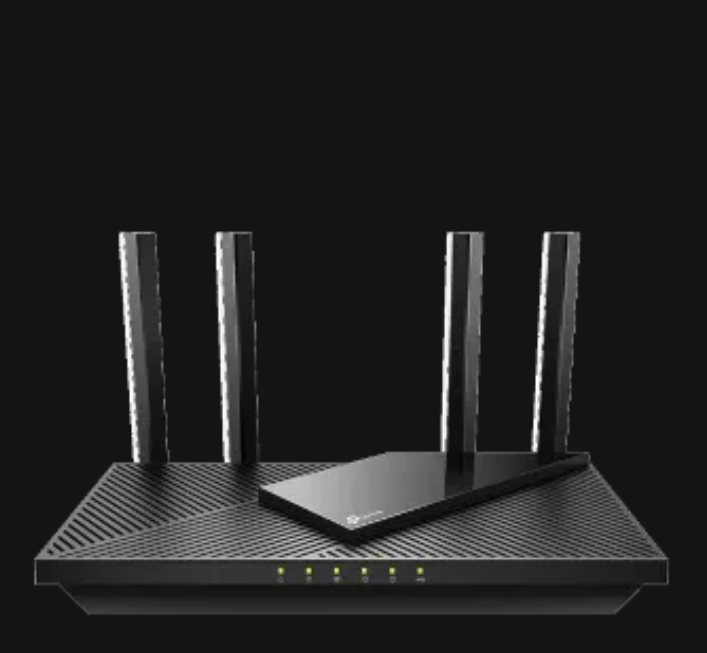

## Usaremos la versión V4 del emulador:

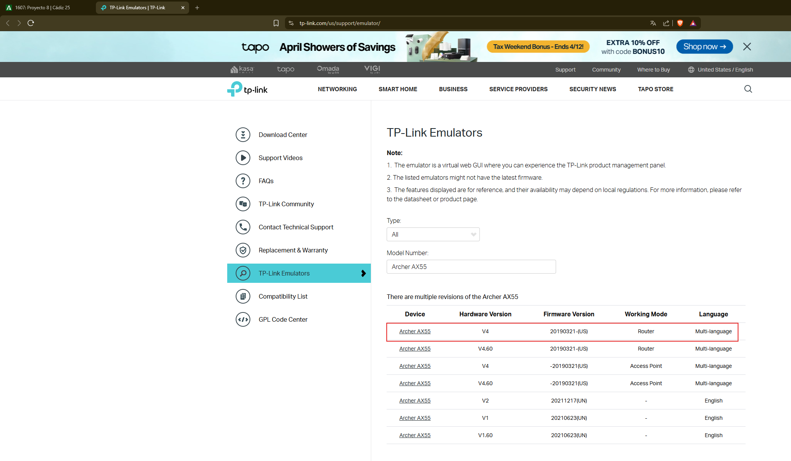

---

## 1. Superficie de ataque y threat model

Antes de aplicar medidas, es necesario identificar los vectores de ataque relevantes para este
dispositivo:

| Vector | Descripción | Probabilidad | Impacto |
|--------|-------------|-------------|---------|
| Acceso al panel web desde LAN | Cualquier dispositivo en la red local puede intentar autenticarse en el panel admin | Alta | Crítico |
| Acceso al panel web desde WAN | Si la administración remota está habilitada, el panel queda expuesto a Internet | Media | Crítico |
| Explotación de servicios activos (UPnP, FTP, Telnet) | Servicios innecesarios activos amplían la superficie de ataque | Alta | Alto |
| Captura de credenciales Wi-Fi | Ataques de diccionario offline contra handshakes WPA2 | Alta | Alto |
| Ataques a dispositivos IoT en la misma red | Movimiento lateral desde un dispositivo IoT comprometido hacia equipos críticos | Media | Alto |
| Explotación de vulnerabilidades conocidas (CVEs) | Firmware sin parchear vulnerable a RCE, command injection o auth bypass | Alta | Crítico |
| Ataque físico (reset de fábrica) | Acceso físico al botón de reset restaura configuración por defecto | Baja | Alto |

---

## 2. CVEs relevantes en la familia Archer (2022-2026)

La familia Archer de TP-Link ha acumulado un historial significativo de vulnerabilidades. Aunque
algunos CVEs afectan formalmente a otros modelos de la misma familia, todos comparten base de
código y módulos de servicio similares al AX55, lo que hace estas vulnerabilidades relevantes por
proximidad arquitectónica.

| CVE | CVSS | Afecta a | Descripción | Medida de mitigación |
|-----|------|---------|-------------|----------------------|
| CVE-2025-15517 | Crítica | Archer NX200/NX210/NX500/NX600 | Authorization Bypass: falta de comprobación de autenticación en endpoints HTTP CGI, permite operaciones privilegiadas sin credenciales | Desactivar admin remota WAN + actualizar firmware |
| CVE-2025-15518 | Alta | Archer NX series | Hardcoded cryptographic key en archivos de configuración, permite descifrar y manipular la configuración del dispositivo | Actualizar firmware |
| CVE-2025-15519 | Alta | Archer NX series | Input validation flaw en CGI endpoints, permite ejecución de comandos arbitrarios | Actualizar firmware + deshabilitar servicios expuestos |
| CVE-2025-14756 | Alta | Archer MR600 v5 | Command Injection autenticado en la interfaz de administración, permite ejecución de comandos del sistema con privilegios de root | Cambiar contraseña admin, actualizar firmware |
| CVE-2025-7850 | Alta | Archer con WireGuard | OS Command Injection vía configuración WireGuard VPN en el panel web | No usar WireGuard en firmware sin parchear |
| CVE-2025-7851 | Alta | Archer (múltiples) | Código de debug residual permite acceso root no autorizado | Actualizar firmware |
| CVE-2025-62501 | 7.0 | Archer (múltiples) | SSH Hostkey misconfiguration en módulo `tmpserver`, permite ataque MITM para captura de credenciales | Deshabilitar SSH si no se usa, actualizar firmware |
| CVE-2026-0630 / CVE-2026-22221-22229 | Hasta 8.6 | Archer BE230 Wi-Fi 7 | Múltiples OS Command Injection en módulos web, VPN, cloud y backup de configuración | Principio de mínimo privilegio en acceso admin |
| CVE-2022-30075 | Alta | Archer AX50 | RCE autenticado en firmware 210730, permite toma de control completa | Actualizar a firmware >= 220303 |

> **Fuentes:** TP-Link Security Advisory Portal, NVD/NIST, CSA Singapore Advisory AL-2026-028,
> INCIBE.

---

## 3. Medidas de bastionado

Las medidas están organizadas de mayor a menor criticidad. Para cada una se indica la ruta exacta
en el panel web del AX55, la justificación técnica y el riesgo asociado si se omite.

---

### 3.1 Actualizar el firmware inmediatamente

**Criticidad:** CRITICA
**Ruta:** `Advanced -> System -> Firmware Upgrade`

La mayoría de CVEs listados en la sección anterior tienen parches publicados. Un dispositivo con
firmware desactualizado es potencialmente explotable de forma remota. La CSA de Singapur emitió
en marzo de 2026 un aviso urgente instando a usuarios de dispositivos Archer a actualizar de
inmediato tras la publicación de CVE-2025-15517.

Al acceder al panel de administración del router, lo primero que aparece es una ventana emergente en la pantalla Network Map informando de que existe una nueva versión de firmware disponible y que la actualización automática programada fue pospuesta porque había usuarios utilizando la red en ese momento. Desde esa ventana se ofrece la opción de pulsar Update Now, que redirige directamente a la sección Advanced -> System -> Firmware Update. En dicha sección se puede realizar la actualización de tres formas: mediante Online Update (pulsando el botón UPDATE, que descarga e instala automáticamente la versión 1.0.2 Build 20190421 desde los servidores de TP-Link), mediante Local Update (subiendo manualmente el archivo de firmware descargado previamente desde el portal oficial, lo que permite verificar el hash SHA256 antes de instalarlo), o mediante EasyMesh Satellite Update para actualizar los nodos satélite vinculados. La vía recomendada para un entorno controlado es la actualización local previa verificación del hash, aunque la actualización online es suficiente para la mayoría de usuarios domésticos.

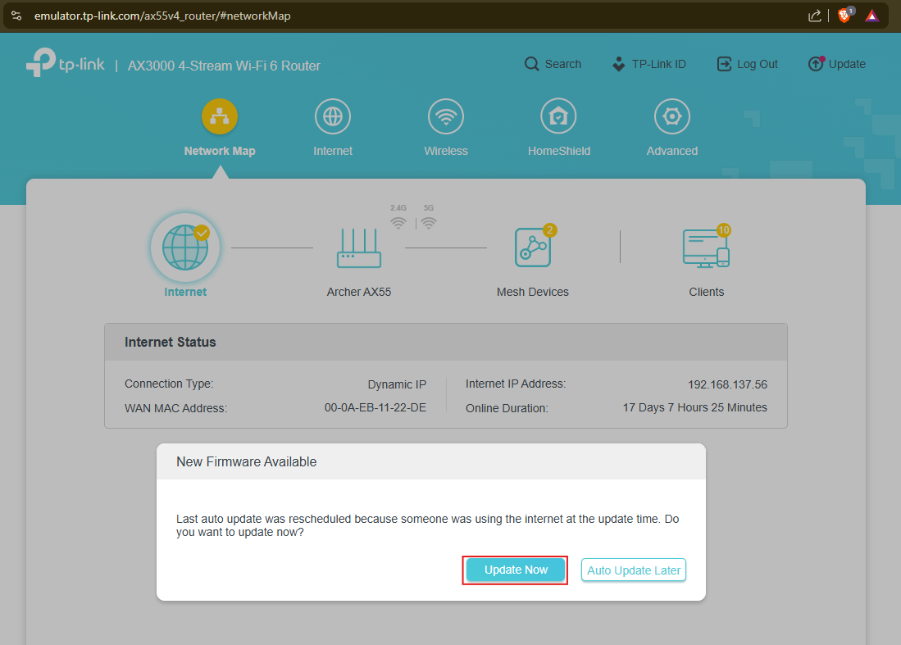

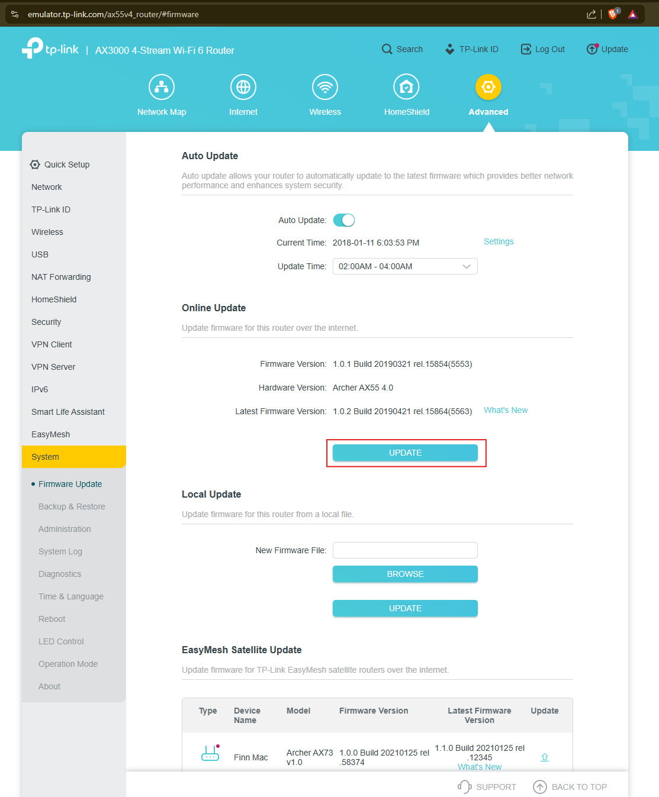

---

### 3.2 Cambiar credenciales de administración por defecto

**Criticidad:** CRITICA
**Ruta:** `Advanced -> System -> Administration`

Las credenciales `admin/admin` o derivadas del número de serie del dispositivo son las primeras
que prueban las botnets (Mirai y variantes). CVE-2025-14756 requiere autenticación previa, lo que
significa que credenciales robustas son una barrera efectiva incluso frente a exploits que
requieren acceso autenticado.

En el emulador cambiamos la contraseña antigua por otra mas nueva.

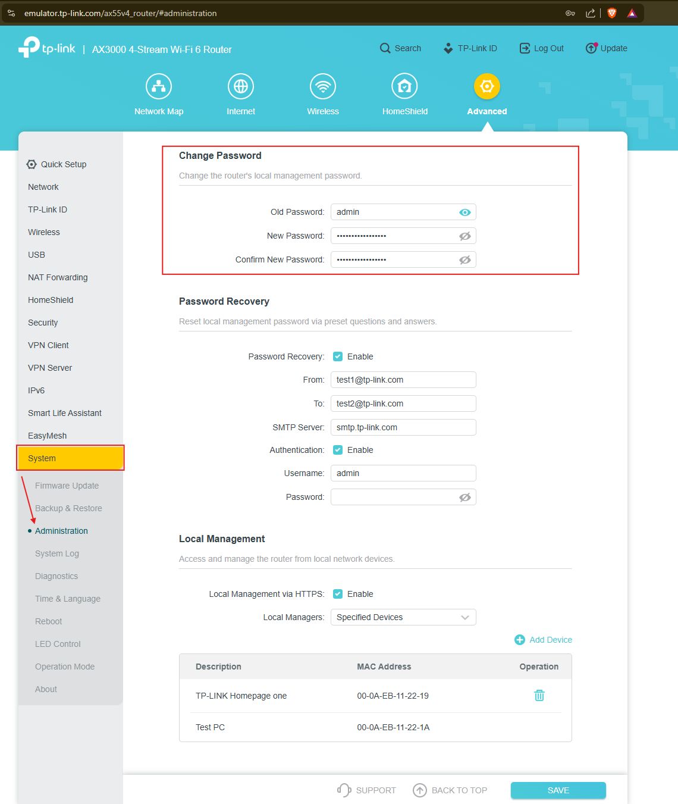

Para mayor seguridad seguir estos pasos es la mejor opción:

**Requisitos de la contraseña:**
- Longitud minima: 16 caracteres
- Combinacion de: mayusculas, minusculas, numeros y simbolos
- No reutilizar contraseñas de otros servicios
- Almacenar en un gestor de contraseñas (Bitwarden, KeePassXC)

**Adicionalmente:**
- Cambiar el nombre de usuario administrador (no usar `admin` por defecto)
- Configurar un timeout de sesion corto (5-10 minutos) para cerrar sesiones administrativas
  inactivas

---

### 3.3 Deshabilitar la administracion remota desde WAN

**Criticidad:** CRITICA
**Ruta:** `Advanced -> System -> Administration -> Remote Management`

CVE-2025-15517 demostro que la ausencia de comprobaciones de autenticacion en ciertos endpoints
CGI del servidor HTTP del router permite operaciones privilegiadas sin credenciales. Si la
administracion remota esta activa, este tipo de vulnerabilidades son explotables directamente
desde Internet.

En el emulador se desactiva **Remote Management**
Tambien se verifica que **Local Management via HTTPS** esta activo y
restringido a **Specified Devices** (dos MACs registradas).

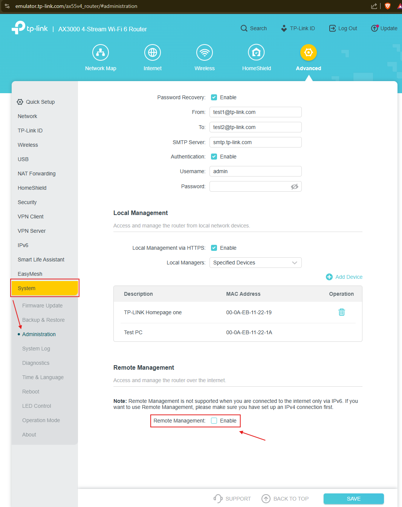

---

### 3.4 Forzar HTTPS para la administracion local

**Criticidad:** ALTA
**Ruta:** `Advanced -> System -> Administration -> Local Management`

Con HTTP en texto plano, las credenciales se transmiten sin cifrar. CVE-2025-62501 sobre SSH
Hostkey misconfiguration ejemplifica como la ausencia de cifrado en protocolos de gestion puede
derivar en capturas de credenciales por MITM.

En el emulador se habilita **Local Management via HTTPS** y se verifica que el acceso
esta restringido a dispositivos especificados por MAC, lo que combina cifrado en transito con
control de acceso por origen.

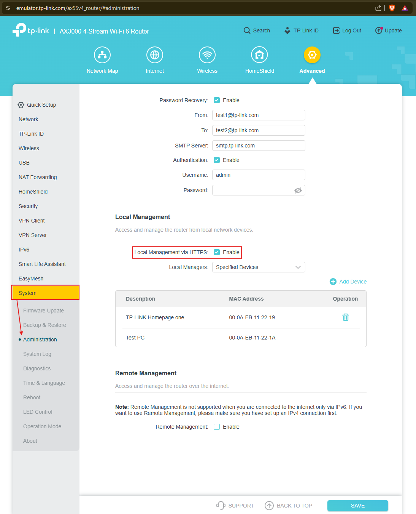

---

### 3.5 Deshabilitar UPnP

**Criticidad:** ALTA
**Ruta:** `Advanced -> NAT Forwarding -> UPnP`

UPnP (Universal Plug and Play) permite a cualquier dispositivo de la red interna abrir puertos en
el firewall del router sin autenticacion. Este mecanismo ha sido abusado por malware para crear
canales de comunicacion encubiertos y exponer servicios internos a Internet. No existe ningun caso
de uso doméstico que justifique mantener UPnP activo si se gestionan manualmente los
port-forwardings necesarios.

En el emulador se desactiva **UPnP**.

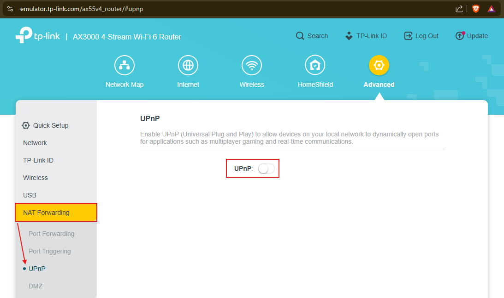

---

### 3.6 Configurar WPA3 y deshabilitar WPS

**Criticidad:** ALTA
**Ruta:** `Wireless -> Wireless Settings -> Security`

WEP es completamente inseguro. WPA con TKIP es vulnerable a ataques practicos. WPA2-Personal con
contraseñas debiles es susceptible a ataques de diccionario offline contra el handshake capturado
con herramientas como `aircrack-ng` o `hashcat`. WPS con autenticacion por PIN es vulnerable a
fuerza bruta (el PIN de 8 digitos se verifica en dos bloques de 4, reduciendo el espacio de
busqueda a ~11.000 combinaciones).

En el emulador se configura: SSID `TomMate` con **WPA3-Personal**
seleccionado, contraseña `Kv#KfirAPQm` (u otra mas robusta), y **Hide SSID** activo.

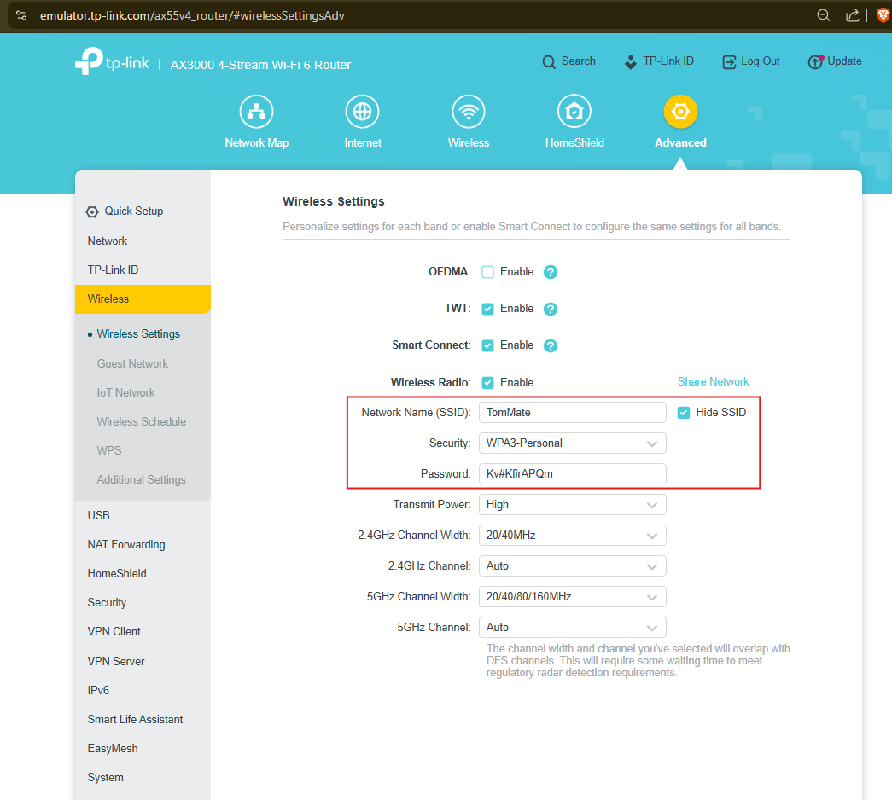

> **Nota sobre WPA3:** WPA3 usa el protocolo SAE (Simultaneous Authentication of Equals) en
> lugar del handshake de 4 vias de WPA2, lo que elimina los ataques de diccionario offline.

---

### 3.7 Segmentar la red: red de invitados e IoT

**Criticidad:** ALTA
**Ruta:** `Advanced -> Wireless -> Guest Network`

Los dispositivos IoT (camaras IP, smart TVs, asistentes de voz, domotica) son vectores de ataque
frecuentes con escasas garantias de seguridad. Si estan en la misma red que los equipos
principales, un compromiso de cualquier dispositivo IoT puede derivar en movimiento lateral hacia
toda la red.

En el emulador se activa la red de invitados configurada con SSID `Franchesco`, seguridad
**WPA2/WPA3-Personal**, contraseña `Mkda@#adfKEI`, **Hide SSID** activo, control de ancho de
banda habilitado (3 Mbps de subida), y tiempo efectivo limitado (3 horas 24 minutos). Las
opciones **Allow guests to see each other** y **Allow guests to access your local network**
se desactivan, para aislar la red de invitados.

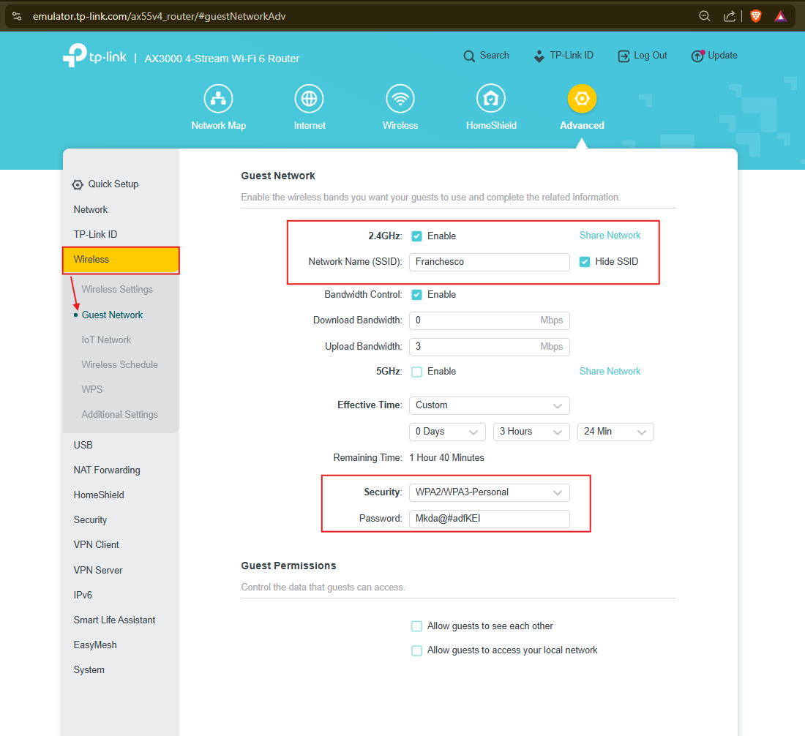

---

### 3.8 Deshabilitar servicios innecesarios

**Criticidad:** ALTA

Cada servicio activo es una potencial superficie de ataque. El principio de minimo privilegio
aplicado a servicios de red dicta que cualquier servicio no estrictamente necesario debe estar
desactivado.

#### USB Storage y FTP

En el emulador se observa la seccion de USB Storage con los cuatro metodos de acceso disponibles:
Samba, Local FTP, Internet FTP y Local SFTP. **Todos los desactivamos**, que es el estado
correcto si no se usa el almacenamiento USB compartido.
Adicionalmente, aplicamos un usuario **RealBetis** con permisos de solo lectura configurado
en **Secure Sharing**.

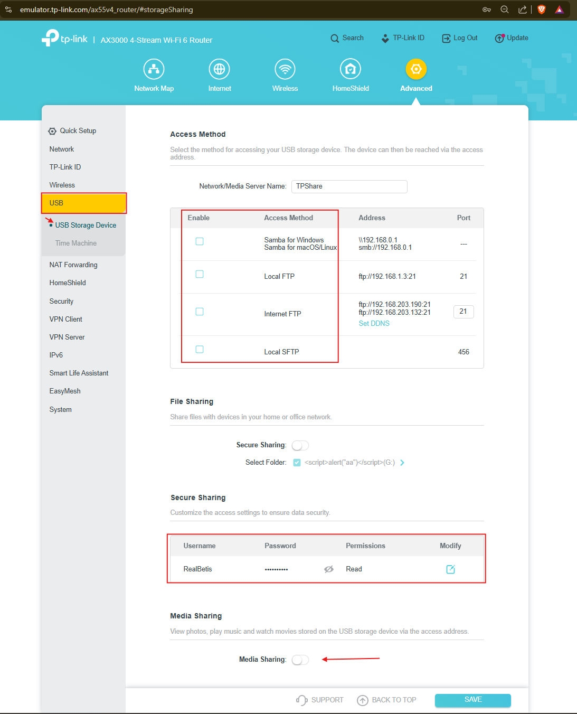

#### IPTV/VLAN e IGMP

En el emulador se desactiva **IPTV/VLAN** y que **IGMP Proxy** e **IGMP
Snooping** tambien se desactivan, con IGMP Version en V3. Esta es la configuracion correcta
si no se usa IPTV.

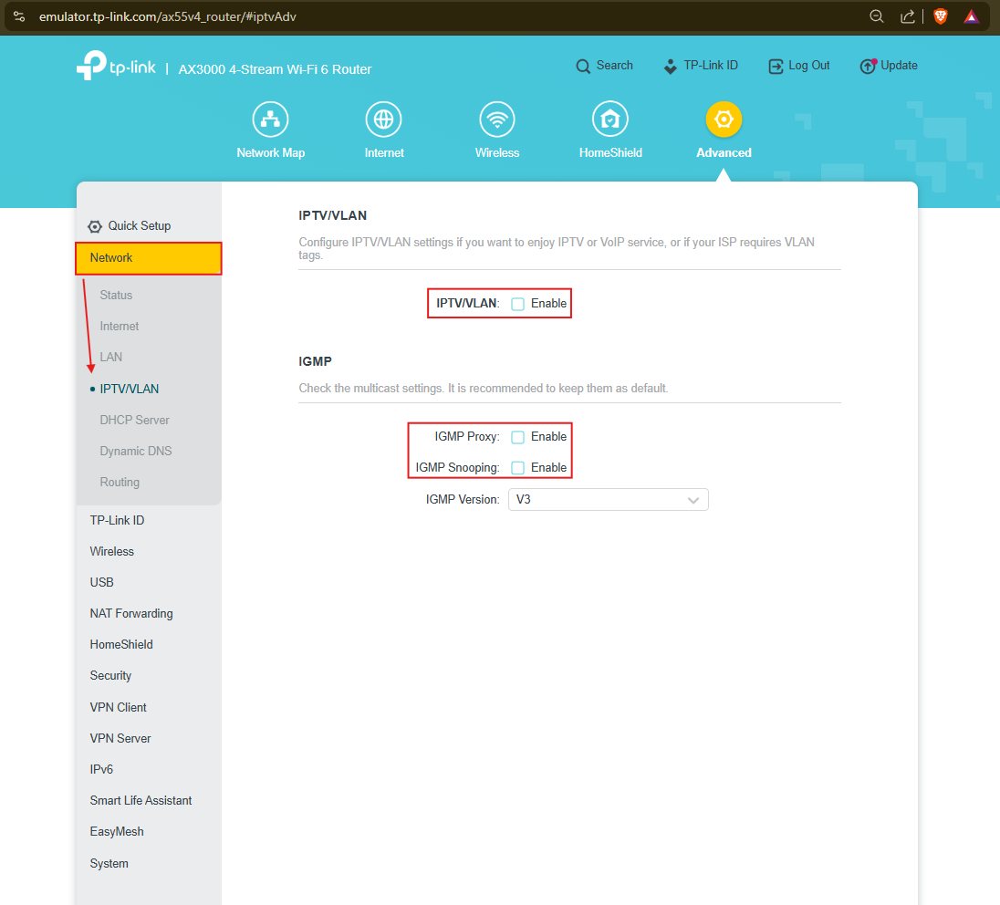

#### IPv6

En el emulador se desactiva **IPv6**. Si el ISP no
proporciona conectividad IPv6 nativa o no se necesita, es recomendable mantenerlo desactivado para
reducir la superficie de ataque.

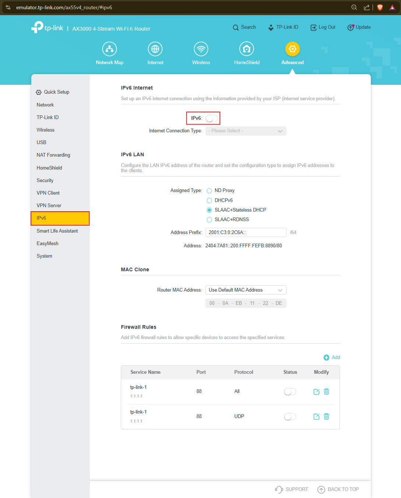

---

### 3.9 Configurar el Firewall SPI

**Criticidad:** ALTA
**Ruta:** `Advanced -> Security -> Firewall`

El firewall SPI (Stateful Packet Inspection) analiza el estado de cada conexion, descartando
paquetes que no correspondan a una conexion iniciada desde la red interna. Sin el, el router
aceptaria trafico entrante no solicitado.

En el emulador se verifica que **SPI Firewall** esta activo. Las opciones **Respond
to Pings from LAN** y **Respond to Pings from WAN** se desactivan.

**No responder a pings desde WAN impide que el router sea identificado en escaneos de red desde
Internet**

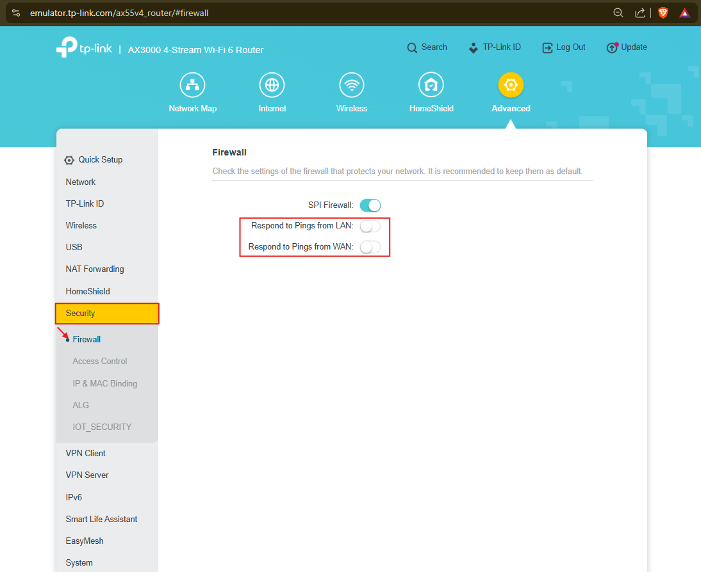

---

### 3.10 Cambiar el SSID por defecto y gestionar la visibilidad

**Criticidad:** MEDIA
**Ruta:** `Wireless -> Wireless Settings`

Un SSID que revela el modelo del router (ej. `TP-Link_AX55_XXXX`) permite a un atacante
identificar inmediatamente el dispositivo y buscar exploits especificos sin necesidad de
reconocimiento adicional.

En el emulador el SSID ha sido cambiado a `TomMate`, que no revela informacion
sobre el fabricante ni el modelo. **Hide SSID** esta activo.

IMAGEN------------------------------------------------------------------------------------------------

---

### 3.11 Configurar acceso remoto seguro mediante VPN

**Criticidad:** MEDIA
**Ruta:** `Advanced -> VPN Server -> OpenVPN`

Si se necesita acceso al router o a la red domestica desde el exterior, la alternativa segura es
establecer un tunel VPN en lugar de exponer servicios directamente.

En el emulador se puede observar la seccion VPN Server con las cuatro opciones disponibles:
**OpenVPN**, **PPTP**, **L2TP/IPSec** y **WireGuard**, ademas de la seccion **Connections**. Se
ha optado por deshabilitar todos los servidores VPN, que es la configuracion correcta cuando no
se necesita acceso remoto. En el caso de necesitarlo, OpenVPN es la unica opcion recomendada
del conjunto disponible.

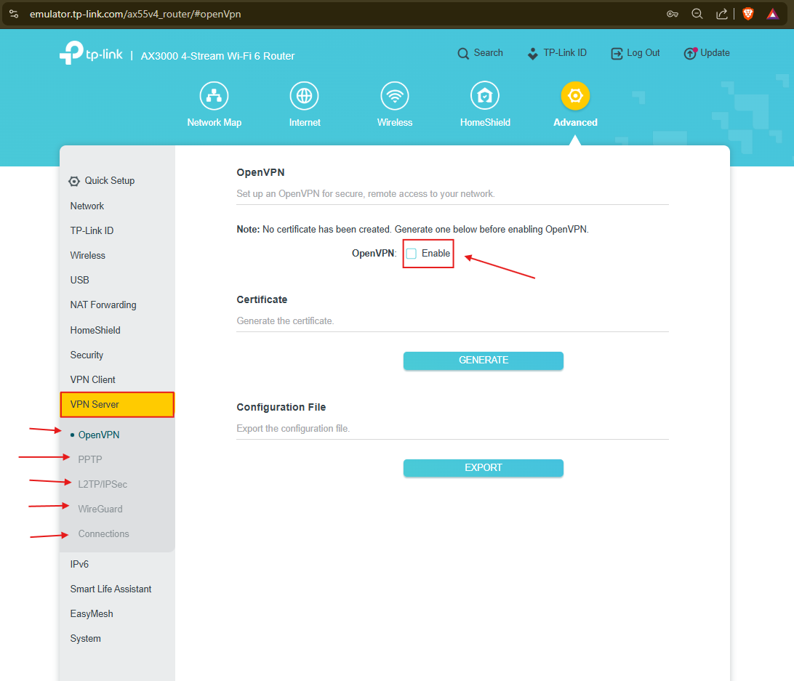

En la seccion **VPN Client** se cambia igualmente a desactivado.

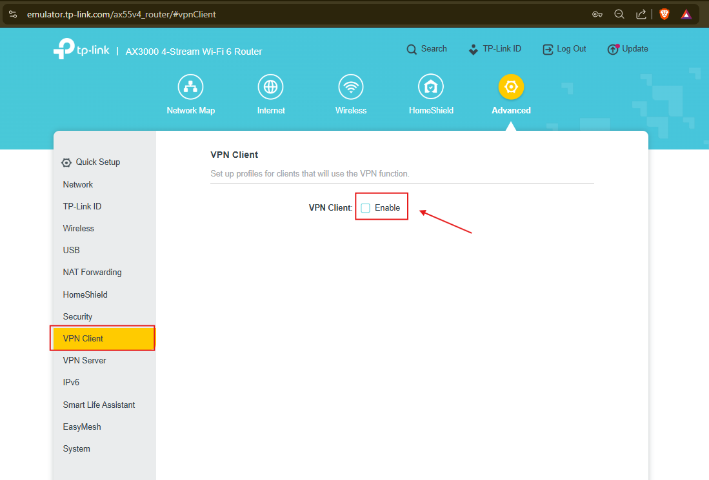

**Opciones disponibles en el AX55:**

| Protocolo | Recomendacion | Motivo |
|-----------|--------------|--------|
| OpenVPN | Recomendado si se necesita VPN | Protocolo maduro, bien auditado, amplia compatibilidad |
| WireGuard | Usar con precaucion | CVE-2025-7850: OS Command Injection via configuracion WireGuard -- actualizar firmware antes de habilitar |
| L2TP/IPSec | No recomendado | Protocolo legacy con implementaciones historicamente debiles |
| PPTP | Prohibido | Roto criptograficamente desde 2012, no ofrece ningun nivel de seguridad real |

---

### 3.12 Configurar servidores DNS seguros

**Criticidad:** MEDIA
**Ruta:** `Network -> DHCP Server`

Los servidores DNS configurados en el DHCP Server determinan a que resolutor envian sus consultas
todos los dispositivos de la red. Un DNS no seguro o comprometido puede redirigir trafico
(DNS hijacking) o registrar todas las consultas de los usuarios.

En el emulador se cambia la configuracion: **Primary DNS** `1.0.0.1` y **Secondary
DNS** `1.1.1.1` (Cloudflare), que ofrecen resolucion rapida, politica de no registro y soporte
para DNS over HTTPS. El pool DHCP ha sido reducido de .100 a .115 (16 direcciones) y el DHCP
Server se habilita para mayor comodidad. Las tres entradas de **Address Reservation** permanecen vinculando MACs
especificas a IPs fijas.

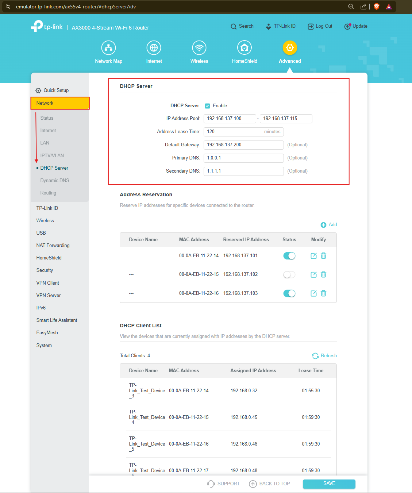

---

### 3.13 Activar y monitorizar los logs del sistema

**Criticidad:** MEDIA
**Ruta:** `Advanced -> System -> System Log`

Los logs permiten detectar actividad anomala: intentos de acceso repetidos, cambios de
configuracion no autorizados, conexiones en puertos inusuales o reinicios inesperados del
dispositivo. Nos aseguramos que el correo sea el oficial.

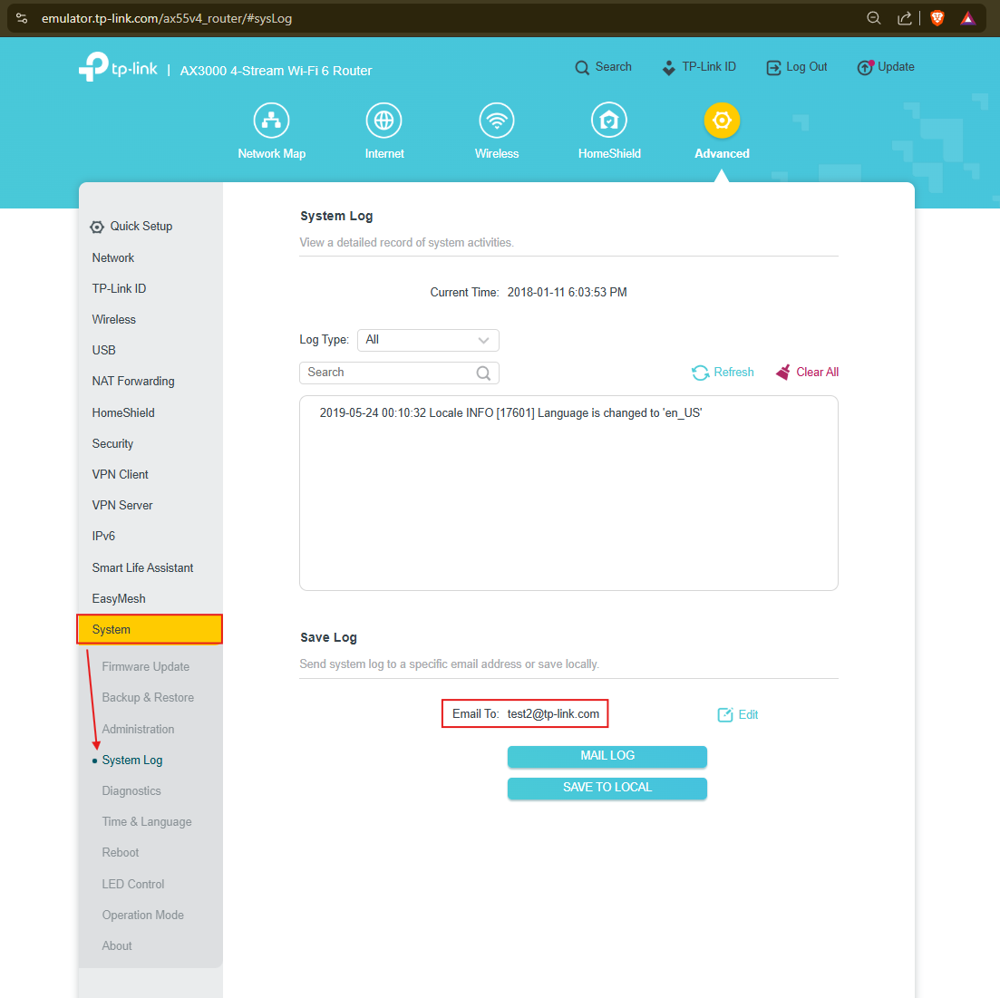

---

### 3.14 Hardening fisico del dispositivo

**Criticidad:** MEDIA

| Medida | Justificacion |
|--------|---------------|
| Ubicar el router en zona de acceso restringido | El boton de reset restaura la configuracion de fabrica sin autenticacion, anulando todas las medidas aplicadas |
| Deshabilitar el boton WPS fisico | `Advanced -> Wireless -> WPS -> desactivar`. Aunque WPS este deshabilitado por software, el boton fisico puede reactivarlo |
| Revisar quien tiene acceso fisico al router en entornos compartidos | En pisos compartidos u oficinas, el acceso fisico es un vector de ataque real |

---

## 4. Mantenimiento y revision periodica

El bastionado de un router no es una tarea puntual, sino un proceso continuo. Las siguientes
acciones deben realizarse de forma regular:

| Tarea | Frecuencia | Herramienta |
|-------|-----------|-------------|
| Verificar disponibilidad de nuevo firmware | Mensual | Portal oficial TP-Link / Auto-update |
| Revisar avisos de seguridad de TP-Link | Mensual | https://www.tp-link.com/us/press/security-advisory/ |
| Revisar logs del sistema | Semanal | Panel web -> System Log |
| Auditar dispositivos conectados a la red | Mensual | `Advanced -> Network Map` |
| Verificar que no hay port-forwardings no reconocidos | Mensual | `Advanced -> NAT Forwarding` |
| Revisar la configuracion completa del router | Cada 90 dias | Panel web completo |
| Cambiar contraseñas Wi-Fi | Cada 6-12 meses | `Wireless -> Wireless Settings` |

# ANEXO - Analisis del Manual Oficial TP-Link Archer AX55 desde una Perspectiva de Seguridad

**Fuente:** User Guide AX3000 Gigabit Wi-Fi 6 Router — Archer AX55
**Referencia:** Documento 1910013469 REV4.0.0, TP-Link 2023

---

## Por que analizar el manual oficial

A diferencia de guias de terceros o articulos de comunidad, el User Guide es el documento que el fabricante incluye con el producto y que la mayoria de usuarios toma como referencia durante la configuracion inicial. Esto lo convierte en un punto de analisis especialmente relevante: sus recomendaciones, y sobre todo sus silencios, tienen un impacto directo en la seguridad del dispositivo una vez instalado en casa o en una empresa.

---

## Lo que el manual hace bien

El documento cubre correctamente algunos aspectos basicos. El capitulo dedicado a la administracion del sistema indica de forma clara que debe establecerse una contrasena de acceso al panel web en el primer arranque, y explica como modificarla posteriormente. Del mismo modo, documenta la opcion de habilitar HTTPS para la gestion local y la posibilidad de restringir el acceso al panel a dispositivos concretos mediante su direccion MAC, dos medidas que suponen una mejora real frente a la configuracion de fabrica.

En cuanto a las actualizaciones de firmware, el manual describe cuatro metodos disponibles y dedica atencion especifica a la actualizacion automatica en horario nocturno, incluyendo la recomendacion de hacer una copia de seguridad de la configuracion antes de proceder. Por ultimo, la gestion remota aparece desactivada por defecto y el manual exige una accion explicita del usuario para habilitarla, lo cual es una decision de diseno acertada.

---

## Las omisiones mas importantes

Aqui es donde el documento muestra sus limitaciones mas significativas.

**WPS** ocupa tres subsecciones completas explicando como conectar dispositivos mediante PIN, boton fisico y PIN del router. En ningun momento se menciona que el sistema de autenticacion por PIN es vulnerable a ataques de fuerza bruta por un fallo de diseno en su verificacion, ni se recomienda desactivarlo tras la configuracion inicial. El resultado es que cualquier usuario que siga el manual tendra WPS permanentemente activo sin saberlo.

**WPA3** aparece en la lista de parametros de seguridad inalambrica, pero el manual se limita a decir que "se recomienda no cambiar los ajustes predeterminados". El problema es que la configuracion de fabrica no garantiza WPA3, y el documento no explica en ningun momento las diferencias entre WPA2, WPA3 y el modo mixto, ni recomienda explicitamente cual usar.

**UPnP** se presenta bajo el titulo "Make Xbox Online Games Run Smoothly", enfocado exclusivamente en la comodidad para videojuegos. No existe ninguna advertencia sobre el hecho de que UPnP permite a cualquier dispositivo de la red local, incluyendo malware, abrir puertos en el firewall sin autenticacion.

**FTP remoto sobre USB** se documenta paso a paso, incluyendo la URL de acceso directo al servicio desde Internet. La unica advertencia es tecnica: si el ISP asigna una IP privada, la funcion no funcionara. No hay ninguna mencion a que FTP transmite credenciales en texto claro, ni a que el servicio queda expuesto directamente a Internet, ni a alternativas mas seguras como SFTP.

**TP-Link Cloud y la app Tether** se describen como una forma conveniente de gestion remota. Lo que no se menciona es que vincular el router a una cuenta TP-Link implica una conexion saliente persistente hacia infraestructura cloud externa, ampliando la superficie de ataque mas alla de la red local. El manual tampoco ofrece informacion sobre como desvincular el dispositivo ni sobre las implicaciones de privacidad asociadas.

**La funcion de recuperacion de contrasena** por correo electronico requiere almacenar credenciales SMTP en el router. El manual no advierte que esas credenciales quedarian expuestas si la configuracion es exportada o el dispositivo comprometido, ni recomienda desactivar la funcion si no se necesita.

---

## Conclusion

El User Guide del Archer AX55 es un documento de configuracion y uso, no una guia de seguridad. Explica correctamente como funciona cada caracteristica del dispositivo, pero trata la seguridad como algo puntual y secundario en lugar de como un eje transversal de la configuracion.

Las omisiones mas graves no son errores tecnicos sino de enfoque: WPS, FTP remoto y UPnP se presentan exclusivamente como funcionalidades utiles, sin el contexto de riesgo necesario para que el usuario tome decisiones informadas. El resultado practico es que un usuario que configure el AX55 siguiendo unicamente el manual oficial terminara con WPS activo, posiblemente con FTP remoto habilitado y con UPnP funcionando, sin haber evaluado en ningun momento si WPA3 esta correctamente configurado. Todas estas son exactamente las condiciones que las medidas de bastionado de esta guia buscan corregir.