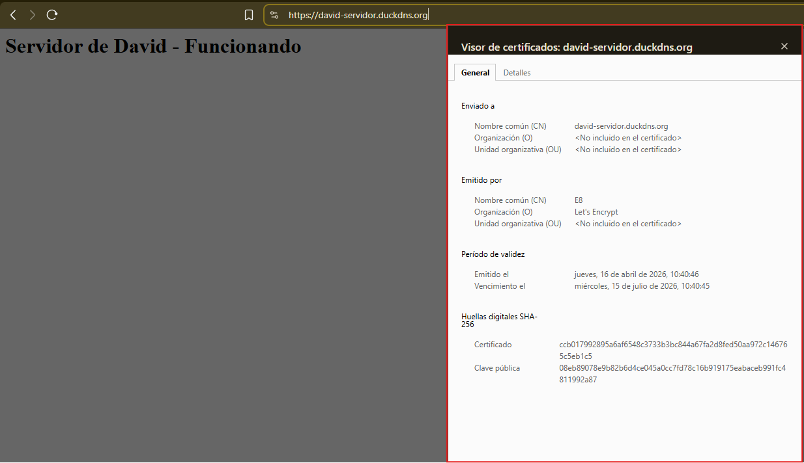
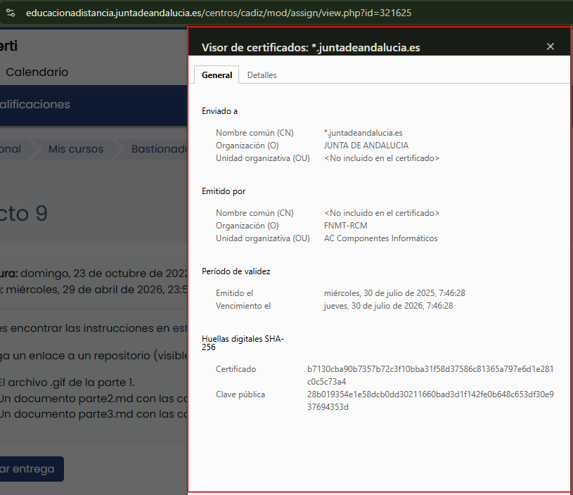

# Análisis Comparativo de Certificados SSL/TLS

## Certificados analizados

- **Certificado A:** david-servidor.duckdns.org (servidor propio con Let's Encrypt)
- **Certificado B:** *.juntadeandalucia.es (organismo público oficial)

---

## Datos extraídos

### Certificado A — david-servidor.duckdns.org

---

### Certificado B — *.juntadeandalucia.es

---

## Comparativa

| Caracteristica | Certificado A (Let's Encrypt) | Certificado B (FNMT-RCM) |
|---|---|---|
| Dominio | david-servidor.duckdns.org | *.juntadeandalucia.es |
| Tipo de dominio | Subdominio gratuito (DuckDNS) | Dominio oficial de organismo publico |
| Tipo de certificado | DV (Domain Validation) | OV (Organization Validation) |
| Identidad verificada | Solo el dominio | Nombre de la organizacion verificado |
| Autoridad Certificadora | Let's Encrypt (CA gratuita) | FNMT-RCM (CA oficial del Estado español) |
| Coste | Gratuito | De pago / institucional |
| Validez | 90 dias | 1 ano |
| Renovacion | Automatica (Certbot) | Manual o gestionada por el organismo |
| Wildcard | No | Si (*.juntadeandalucia.es) |
| Datos de organizacion | No incluidos | Incluidos (JUNTA DE ANDALUCIA) |
| Nivel de confianza | Basico — cifrado garantizado | Alto — identidad institucional verificada |
| Cifrado | TLS (SHA-256) | TLS (SHA-256) |

---

## Conclusiones

Ambos certificados garantizan el cifrado del trafico entre el cliente y el servidor
mediante TLS con huellas SHA-256, por lo que la seguridad de la transmision de datos
es equivalente en ambos casos.

La diferencia principal reside en el nivel de validacion de identidad:

- El certificado de Let's Encrypt es de tipo **DV (Domain Validation)**, lo que significa
  que la autoridad certificadora unicamente verifica que el solicitante controla el dominio,
  sin comprobar la identidad real de la organizacion o persona detrás de él. Es adecuado
  para proyectos personales, entornos de prueba y servidores que no manejan datos sensibles.

- El certificado de la Junta de Andalucia es de tipo **OV (Organization Validation)**,
  emitido por la FNMT-RCM, que es la Fabrica Nacional de Moneda y Timbre, autoridad
  certificadora oficial del Estado espanol. Este tipo de certificado requiere verificar
  documentalmente que la organizacion existe y es legitima, lo que otorga un mayor nivel
  de confianza para los usuarios.

Otra diferencia relevante es la duracion: Let's Encrypt emite certificados de 90 dias
renovables automaticamente, mientras que el certificado institucional tiene una validez
de 1 año gestionada manualmente. Ademas, el certificado de la Junta es de tipo wildcard
(*.juntadeandalucia.es), lo que permite cubrir todos los subdominios del dominio principal
con un unico certificado.