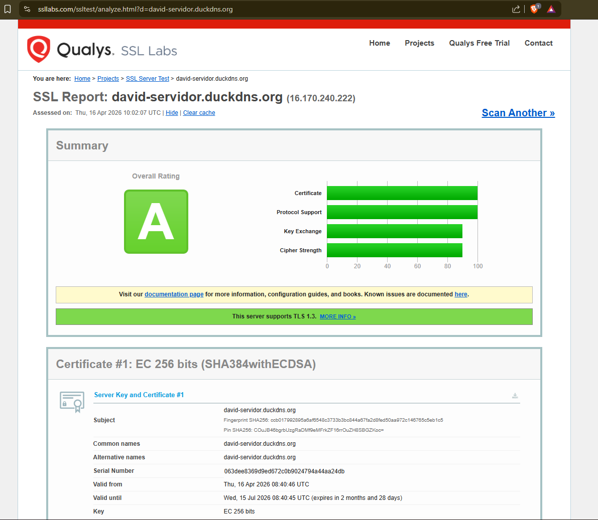
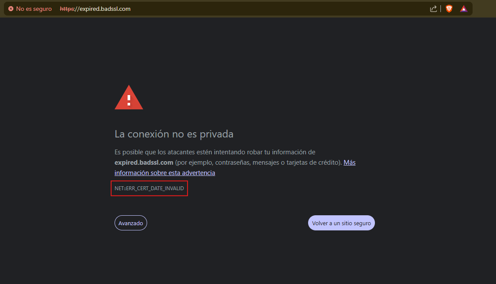
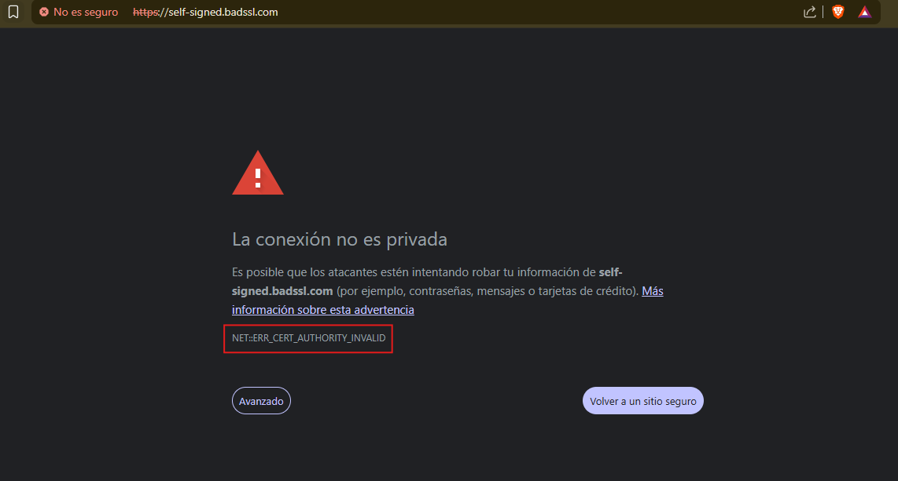
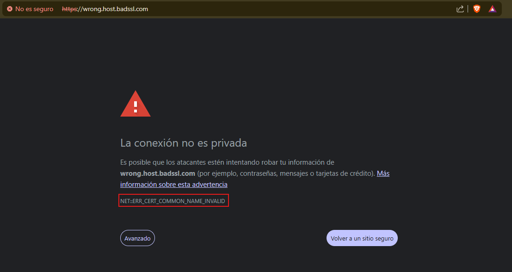

# Validez del certificado SSL/TLS — david-servidor.duckdns.org

Mi servidor ha obtenido una calificacion **A** en Qualys SSL Labs.

---

## Por que es valido

El certificado fue emitido por **Let's Encrypt (E8)**, cuya cadena de confianza
llega hasta **ISRG Root X1**, una autoridad raiz reconocida por Mozilla, Apple,
Android, Java y Windows. Esto significa que cualquier navegador o sistema operativo
moderno lo acepta sin advertencias.

En cuanto a fechas, fue emitido el **16 de abril de 2026** y es valido hasta el
**15 de julio de 2026**, por lo que en el momento del analisis se encontraba dentro
de su periodo de vigencia.

Ademas, el estado de revocacion consultado via CRL devuelve **"Good (not revoked)"**,
lo que confirma que Let's Encrypt no lo ha anulado por ningun motivo. El certificado
tambien esta registrado en los logs publicos de **Certificate Transparency**, lo que
permite detectar cualquier emision fraudulenta o no autorizada.

La cadena de confianza esta completa: se suministran el certificado del servidor y
el intermedio (E8), sin ningun problema de cadena. Por ultimo, la clave **EC de
256 bits** no pertenece a las claves debiles conocidas de Debian, descartando ese
vector de compromiso historico.

---

## Resumen

El certificado es valido porque:

- Proviene de una CA globalmente reconocida (Let's Encrypt / ISRG Root X1)
- Se encuentra dentro de su periodo de vigencia
- No ha sido revocado por la autoridad certificadora
- Su cadena de certificacion esta correctamente configurada y completa
- La clave criptografica no presenta debilidades conocidas

[Resultados Qualys SSL Labs](pdfs/SSLTest.pdf)

# Analisis de Certificados SSL/TLS no Validos

Para este analisis se han utilizado los subdominios de badssl.com, un proyecto
mantenido sobre infraestructura de Google Cloud disenado especificamente para
probar el comportamiento de clientes ante configuraciones SSL erroneas. Cada
subdominio expone intencionalmente un tipo de error diferente. El servicio de
analisis utilizado es Qualys SSL Labs.

---

## Caso 1 — Certificado caducado

**Dominio:** expired.badssl.com
**Tipo de error:** Certificado fuera de su periodo de validez
**Calificacion SSL Labs:** T (Not trusted)

### Datos del certificado

| Campo | Valor |
|---|---|
| Emitido por | COMODO RSA Domain Validation Secure Server CA |
| Valido desde | 9 de abril de 2015 |
| Valido hasta | 12 de abril de 2015 |
| Clave | RSA 2048 bits |

### Por que no es valido

El certificado vencio el 12 de abril de 2015, por lo que lleva mas de una
decada caducado. Durante el handshake TLS, el cliente comprueba que la fecha
actual se encuentre dentro del intervalo notBefore-notAfter. Al no cumplirse
esa condicion, el navegador rechaza la conexion y muestra el error
`NET::ERR_CERT_DATE_INVALID`.

Qualys SSL Labs asigna automaticamente la calificacion T (not trusted) a
cualquier servidor cuyo certificado no este dentro de su periodo de validez,
con independencia del resto de la configuracion. La CA emisora (COMODO) no
tiene ningun mecanismo para extender retroactivamente la validez: el unico
remedio posible seria emitir un certificado nuevo.

[Resultados Qualys SSL Labs](pdfs/Invalid_1.pdf)

---

## Caso 2 — Certificado autofirmado

**Dominio:** self-signed.badssl.com
**Tipo de error:** Certificado sin respaldo de una CA de confianza publica
**Calificacion SSL Labs:** T (Not trusted)

### Datos del certificado

| Campo | Valor |
|---|---|
| Emitido por | El propio servidor (BadSSL) |
| Firmante | Coincide con el sujeto — no hay CA externa |
| Cadena de confianza | Incompleta — no llega a ninguna raiz reconocida |

### Por que no es valido

Un certificado autofirmado es aquel en el que el campo Issuer y el campo
Subject son identicos: el servidor se avala a si mismo. Ningun navegador ni
sistema operativo incluye esa entidad en su almacen de raices de confianza,
por lo que la cadena de certificacion no puede completarse.

El proceso de validacion TLS requiere poder remontar la cadena desde el
certificado del servidor hasta una CA raiz reconocida globalmente. Al no
existir ese ancla de confianza, el cliente no puede verificar la identidad
del servidor y no hay garantia de que no se este produciendo un ataque de
intermediario (MITM). El error que muestran los navegadores suele ser
`NET::ERR_CERT_AUTHORITY_INVALID`.

SSL Labs califica el servidor con T por el mismo motivo que en el caso
anterior: el certificado no es de confianza, lo que anula cualquier
valoracion de protocolo o cifrado.

[Resultados Qualys SSL Labs](pdfs/Invalid_2.pdf)

---

## Caso 3 — Discrepancia de dominio (name mismatch)

**Dominio:** wrong.host.badssl.com
**Tipo de error:** El certificado no cubre el dominio al que se accede
**Calificacion SSL Labs:** M (Certificate name mismatch)

### Datos del certificado

| Campo | Valor |
|---|---|
| Emitido por | CA reconocida |
| CN / SAN cubiertos | *.badssl.com, badssl.com |
| Dominio solicitado | wrong.host.badssl.com |

### Por que no es valido

El certificado presentado por el servidor es tecnicamente valido en cuanto
a fechas, cadena y firma, pero esta emitido para `*.badssl.com` y
`badssl.com`. El dominio `wrong.host.badssl.com` no encaja en ninguno de
esos nombres, ya que un wildcard de primer nivel (`*.badssl.com`) no cubre
subdominios de segundo nivel (`wrong.host.badssl.com`).

Durante el handshake, el cliente comprueba que el hostname al que se conecta
aparezca en el campo Common Name (CN) o en los Subject Alternative Names
(SAN) del certificado. Al no encontrar coincidencia, el navegador interrumpe
la conexion con el error `NET::ERR_CERT_COMMON_NAME_INVALID` en Chrome o
`SSL_ERROR_BAD_CERT_DOMAIN` en Firefox.

Qualys SSL Labs asigna la calificacion especial M para este caso,
diferenciandolo de la escala A-F habitual, porque se trata de un problema
de identidad: el cifrado puede ser perfecto, pero el servidor no puede
demostrar que es quien dice ser para ese dominio concreto.

[Resultados Qualys SSL Labs](pdfs/Invalid_3.pdf)

---

## Tabla comparativa

| Caso | Dominio | Error en navegador | Calificacion | Causa raiz |
|---|---|---|---|---|
| Certificado caducado | expired.badssl.com | NET::ERR_CERT_DATE_INVALID | T | Fecha de vencimiento superada |
| Certificado autofirmado | self-signed.badssl.com | NET::ERR_CERT_AUTHORITY_INVALID | T | Emisor no reconocido por ninguna CA |
| Discrepancia de dominio | wrong.host.badssl.com | NET::ERR_CERT_COMMON_NAME_INVALID | M | CN/SAN no coincide con el dominio accedido |