# Proyecto 11 - Emulacion de adversarios en Docker

## Objetivo

Este proyecto implementa un laboratorio controlado para probar una infraestructura bastionada frente a comportamientos no deseados. El entorno permite desplegar un servidor, aplicar configuracion con Ansible, comprobar el bastionado con un perfil compatible con InSpec y emular actividad adversaria desde una red atacante.

El objetivo principal es demostrar dos puntos de la rubrica:

- Deteccion e identificacion de comportamientos no deseados mediante registros y contadores del cortafuegos.
- Implementacion de contramedidas para mitigar esos comportamientos.

Todas las pruebas se han realizado en un laboratorio Docker local y aislado.

## Infraestructura desplegada

El laboratorio se compone de cuatro contenedores:

| Contenedor | Funcion | Redes |
|---|---|---|
| `p11-firewall` | Cortafuegos/router con `iptables`, registro de trafico y reglas de mitigacion. | `attacker_net`, `dmz_net` |
| `p11-attacker` | Equipo atacante para emular reconocimiento, fuerza bruta SSH, rafagas DNS y movimiento lateral. | `attacker_net` |
| `p11-target` | Servidor objetivo bastionado con SSH, HTTP y DNS. | `dmz_net`, `mgmt_net` |
| `p11-control` | Equipo de administracion con Ansible y Cinc Auditor, compatible con perfiles InSpec. | `mgmt_net` |

Topologia logica:

```text
          attacker_net 10.11.0.0/24          dmz_net 10.12.0.0/24
 p11-attacker 10.11.0.10  ---->  p11-firewall  ---->  p11-target 10.12.0.10
                                      |
                                      | mgmt_net 10.30.0.0/24
                                      |
                                p11-control 10.30.0.10
                                p11-target  10.30.0.20
```

La red `mgmt_net` se usa para administracion y comprobacion. La red `attacker_net` simula el origen de la actividad no deseada, y todo el trafico hacia el servidor de la DMZ pasa por el cortafuegos.

## Estructura del proyecto

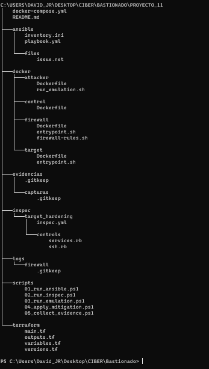

La carpeta `proyecto_11` contiene:

- `docker-compose.yml`: despliegue de los cuatro contenedores.
- `docker/`: Dockerfiles y scripts internos de firewall, atacante, servidor objetivo y control.
- `ansible/`: inventario y playbook de bastionado.
- `inspec/`: perfil de comprobacion de seguridad.
- `terraform/`: definicion documental de redes Docker equivalentes.
- `scripts/`: comandos auxiliares para ejecutar Ansible, auditoria, emulacion, mitigacion y recogida de evidencias.
- `evidencias/`: capturas y salidas de comandos generadas durante las pruebas.

## Despliegue con Docker

El laboratorio se levanta desde la carpeta `proyecto_11`:

```powershell
cd C:\Users\David_JR\Desktop\CIBER\Bastionado\proyecto_11
docker compose up -d --build
docker compose ps
```

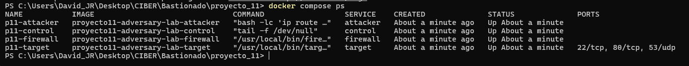

La salida muestra los contenedores `p11-firewall`, `p11-target`, `p11-attacker` y `p11-control` creados y en ejecucion.

## Topologia comprobada

Se inspeccionaron las redes Docker para verificar que las IP coinciden con el diseno:

```powershell
docker compose ps
docker network inspect proyecto11-adversary-lab_attacker_net
docker network inspect proyecto11-adversary-lab_dmz_net
```

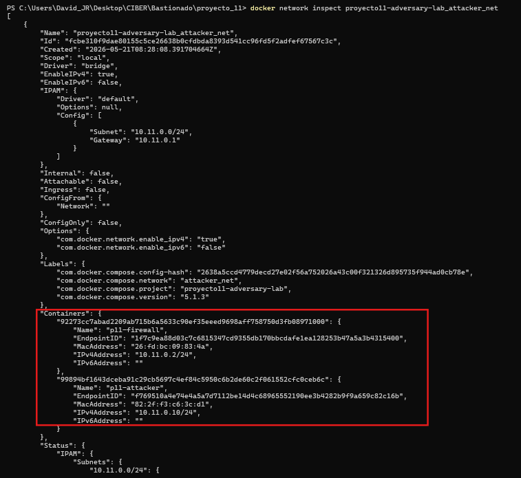

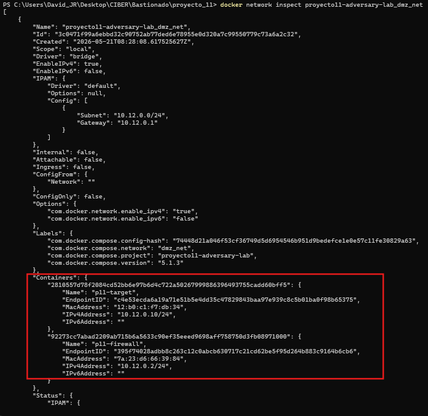

Direcciones principales:

- Atacante: `10.11.0.10`
- Firewall en red atacante: `10.11.0.2`
- Firewall en DMZ: `10.12.0.2`
- Servidor objetivo en DMZ: `10.12.0.10`
- Control: `10.30.0.10`
- Servidor objetivo en red de gestion: `10.30.0.20`

## Bastionado con Ansible

El bastionado se aplica desde el contenedor de control:

```powershell
docker compose exec -T control bash -lc "ansible-playbook -i ansible/inventory.ini ansible/playbook.yml"
```

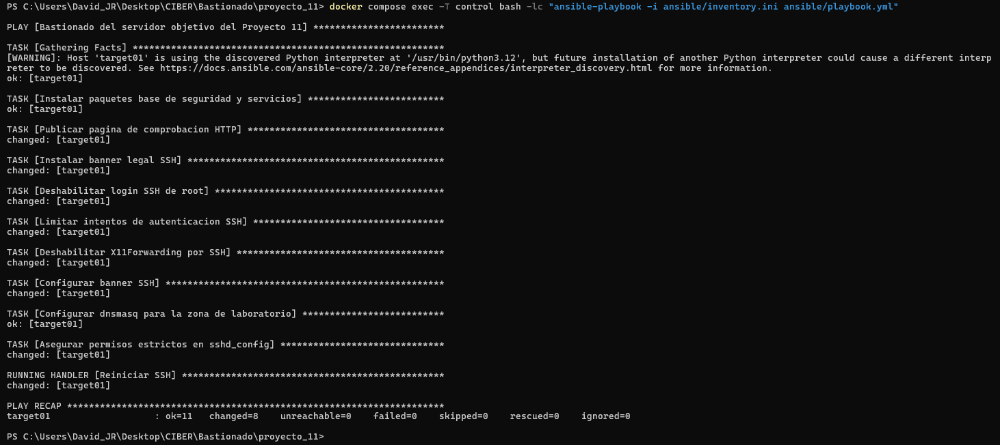

El playbook realiza las siguientes acciones:

- Instala servicios necesarios: `openssh-server`, `nginx` y `dnsmasq`.
- Configura una pagina HTTP de comprobacion.
- Configura un banner legal SSH.
- Deshabilita el acceso SSH directo como `root`.
- Limita los intentos de autenticacion SSH con `MaxAuthTries 3`.
- Deshabilita `X11Forwarding`.
- Asegura permisos estrictos sobre `/etc/ssh/sshd_config`.

El resultado del `PLAY RECAP` muestra `failed=0`, por lo que la configuracion se aplica correctamente.

## Comprobacion con perfil tipo InSpec

Para la validacion se usa Cinc Auditor, herramienta compatible con perfiles InSpec:

```powershell
docker compose exec -T control bash -lc "cinc-auditor exec inspec/target_hardening -t ssh://alumno@10.30.0.20 --password alumno --sudo --sudo-password alumno --no-create-lockfile"
```

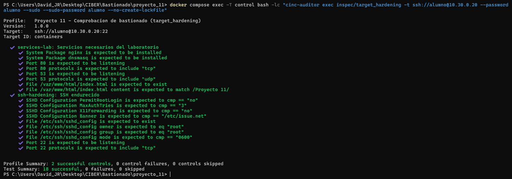

El perfil comprueba:

- `PermitRootLogin no`
- `MaxAuthTries 3`
- `X11Forwarding no`
- `Banner /etc/issue.net`
- Permisos de `/etc/ssh/sshd_config`
- Servicios escuchando en `22/tcp`, `80/tcp` y `53/udp`
- Presencia del contenido HTTP del laboratorio

La comprobacion valida que el bastionado aplicado por Ansible queda correctamente implantado.

## Emulacion de adversarios en modo baseline

En esta version del laboratorio no se ha ejecutado Infection Monkey ni CALDERA. Por falta de tiempo y por limitaciones tecnicas del entorno, se ha optado por una emulacion controlada con un contenedor atacante propio. La documentacion oficial de Infection Monkey indica que su contenedor Docker esta soportado en Linux y no es compatible con Docker for Windows o Docker for Mac:

```text
https://techdocs.akamai.com/infection-monkey/docs/docker
```

Como el laboratorio se ha desarrollado sobre Docker Desktop en Windows, ejecutar Infection Monkey de forma fiable habria requerido migrar el entorno a una VM Linux o rehacer la topologia para que el agente atravesase correctamente el cortafuegos. Para mantener una prueba reproducible dentro del tiempo disponible, se han simulado comportamientos equivalentes: reconocimiento de puertos, fuerza bruta SSH, rafagas DNS e intentos de conexion a servicios no publicados.

La emulacion se ejecuta desde el contenedor atacante:

```powershell
docker compose exec -T attacker bash -lc "/opt/emulation/run_emulation.sh"
```

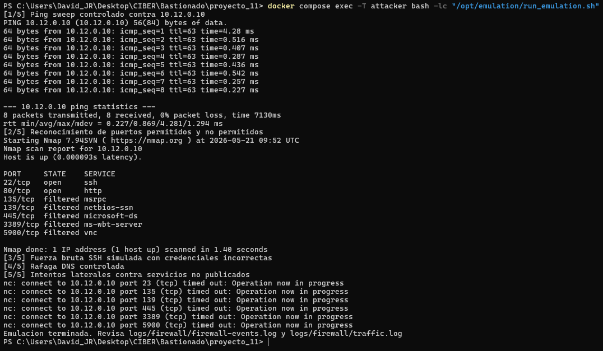

El script emula los siguientes comportamientos:

| Fase | Tecnica simulada | Herramienta |
|---|---|---|
| 1 | Barrido ICMP controlado | `ping` |
| 2 | Reconocimiento de puertos | `nmap` |
| 3 | Fuerza bruta SSH simulada | `sshpass` |
| 4 | Rafaga de consultas DNS | `dig` |
| 5 | Intento de conexion a servicios no publicados | `nc` |

En la captura se observa que SSH y HTTP aparecen abiertos, mientras que puertos asociados a exposicion lateral, como `135`, `139`, `445`, `3389` y `5900`, aparecen como `filtered`.

## Deteccion en el cortafuegos

La deteccion se comprueba con contadores de `iptables` y con el registro de trafico capturado por `tcpdump`.

```powershell
docker compose exec -T firewall bash -lc "iptables -L FORWARD -n -v --line-numbers"
```

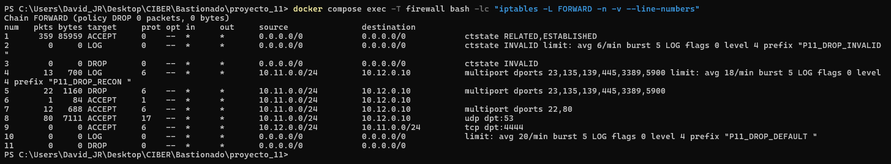

En esta evidencia se observa:

- Regla `P11_DROP_RECON` con paquetes contabilizados.
- Regla `DROP` asociada a puertos no publicados.
- Bloqueo de intentos hacia `23`, `135`, `139`, `445`, `3389` y `5900`.

En Docker Desktop los eventos generados con `iptables -j LOG` no siempre se vuelcan dentro del archivo `firewall-events.log`. Por este motivo, la evidencia principal de deteccion se obtiene mediante contadores de reglas y el registro `traffic.log`.

## Registro de trafico observado

```powershell
docker compose exec -T firewall bash -lc "tail -n 80 /var/log/firewall/traffic.log"
```

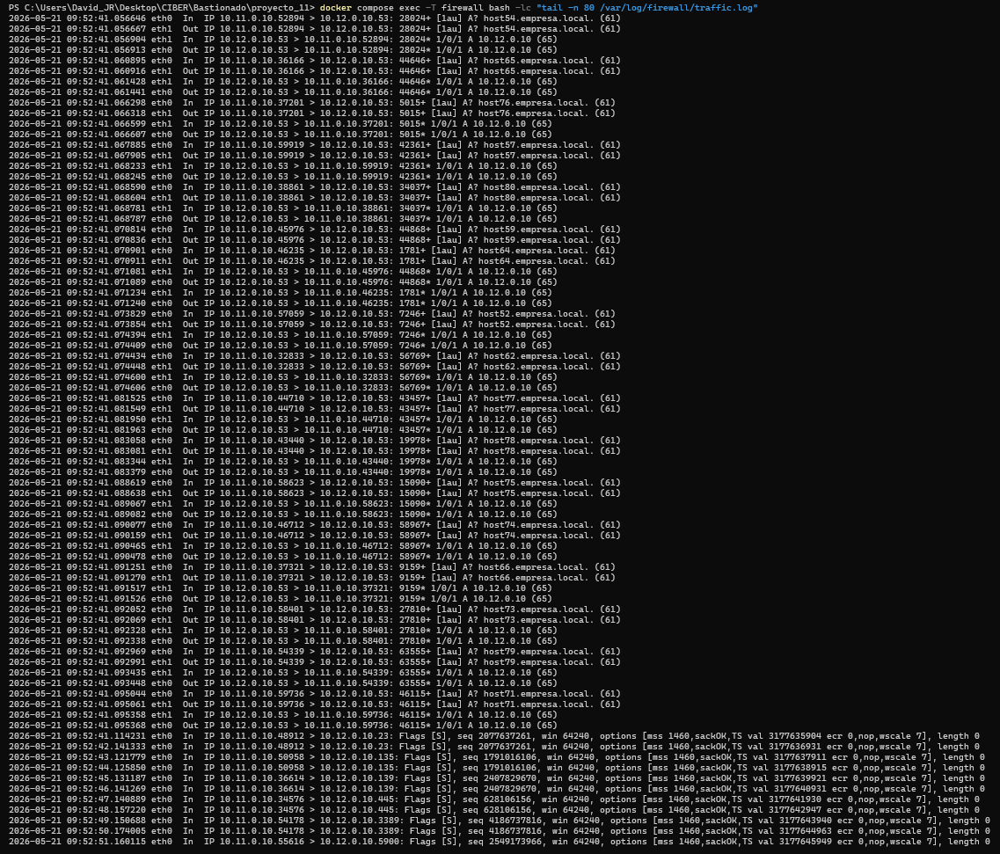

El registro muestra:

- Consultas DNS desde `10.11.0.10` hacia `10.12.0.10:53`.
- Respuestas DNS desde el servidor objetivo.
- Intentos TCP hacia puertos no publicados.
- Trafico atravesando el cortafuegos entre `attacker_net` y `dmz_net`.

Esta captura permite identificar el origen, destino, protocolo y puerto de la actividad no deseada.

## Contramedidas implementadas

El cortafuegos dispone de dos modos:

- `baseline`: permite observar la actividad y bloquea puertos laterales de alto riesgo.
- `strict`: activa mitigaciones especificas frente a los comportamientos detectados.

La mitigacion se aplica con:

```powershell
docker compose exec -T firewall bash -lc "firewall-rules.sh strict"
docker compose exec -T firewall bash -lc "iptables -L FORWARD -n -v --line-numbers"
```

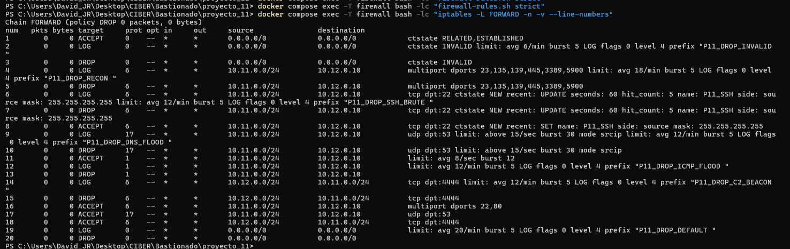

Medidas aplicadas:

- Politica `FORWARD DROP` por defecto.
- Bloqueo de puertos no publicados: `23`, `135`, `139`, `445`, `3389`, `5900`.
- Limitacion de fuerza bruta SSH con el modulo `recent`.
- Limitacion de rafagas DNS con `hashlimit`.
- Limitacion de ICMP.
- Bloqueo de beacon C2 simulado hacia `tcp/4444`.

## Prueba posterior a la mitigacion

Tras activar el modo `strict`, se repite la emulacion:

```powershell
docker compose exec -T attacker bash -lc "/opt/emulation/run_emulation.sh"
docker compose exec -T firewall bash -lc "iptables -L FORWARD -n -v --line-numbers"
```

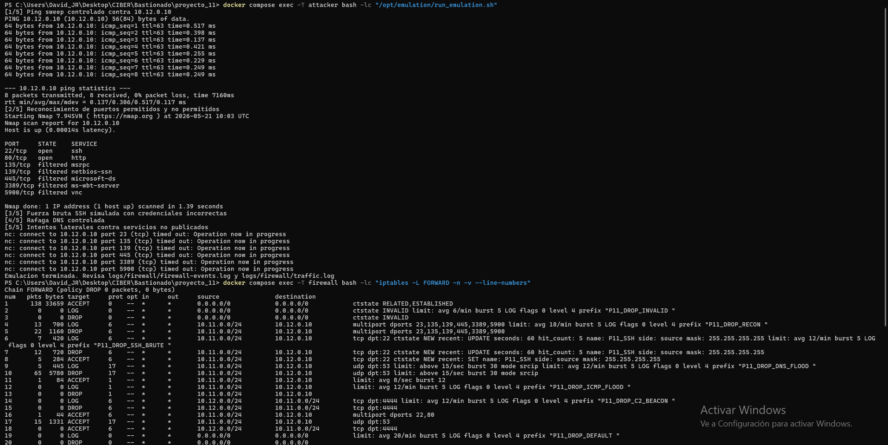

En esta captura se comprueba que las contramedidas actuan:

- `P11_DROP_RECON`: detecta y bloquea reconocimiento contra puertos laterales.
- `P11_DROP_SSH_BRUTE`: detecta intentos repetidos de conexion SSH.
- `P11_DROP_DNS_FLOOD`: limita y bloquea parte de la rafaga DNS.
- Las reglas `DROP` asociadas aumentan sus contadores, demostrando que el trafico se mitiga.

## Recogida de evidencias

Las evidencias en texto se exportan con:

```powershell
.\scripts\05_collect_evidence.ps1
```

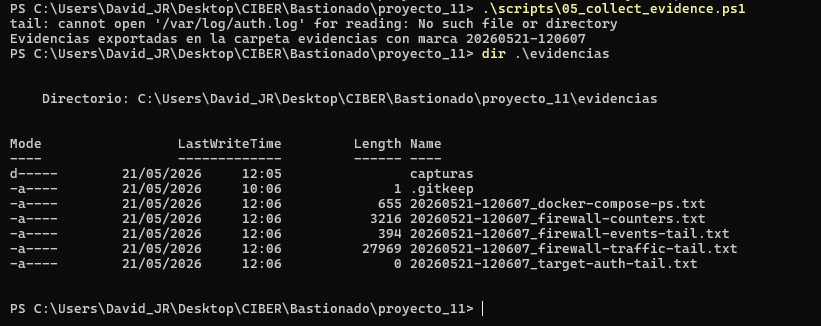

El script genera archivos en `evidencias/`:

- `docker-compose-ps.txt`
- `firewall-counters.txt`
- `firewall-events-tail.txt`
- `firewall-traffic-tail.txt`
- `target-auth-tail.txt`
- `target-hardening.txt`
- `target-services-tail.txt`

Estos archivos complementan las capturas y permiten revisar posteriormente el estado de contenedores, reglas del firewall, trafico y logs del objetivo.

## Terraform

La carpeta `terraform/` se incluye porque el enunciado exige entregar automatizacion con Terraform. En este laboratorio, el despliegue operativo se ha realizado con Docker Compose, ya que facilita el uso de contenedores privilegiados, redes, volumenes y comandos interactivos.

Terraform documenta las redes equivalentes:

- `10.11.0.0/24` para atacante.
- `10.12.0.0/24` para DMZ.
- `10.30.0.0/24` para gestion.

Validacion opcional:

```powershell
cd terraform
terraform init
terraform validate
cd ..
```

## Conclusiones

El laboratorio demuestra que una infraestructura desplegada en Docker puede usarse para emular comportamientos adversarios y validar defensas perimetrales. La primera ejecucion permite observar actividad sospechosa, como reconocimiento de puertos, fuerza bruta SSH simulada y rafagas DNS. Despues, el modo estricto del cortafuegos aplica contramedidas y los contadores de `iptables` demuestran que los comportamientos detectados son mitigados.

Con esto se cumplen los objetivos principales del proyecto: desplegar una infraestructura reproducible, aplicar bastionado automatizado, verificarlo con controles y analizar la respuesta del cortafuegos ante actividad no deseada. La principal limitacion de la entrega es que la emulacion se ha realizado con herramientas controladas propias en lugar de una ejecucion real de Infection Monkey.

## Limpieza del laboratorio

Para detener el entorno:

```powershell
docker compose down
```

Para eliminar tambien volumenes asociados:

```powershell
docker compose down --volumes
```
